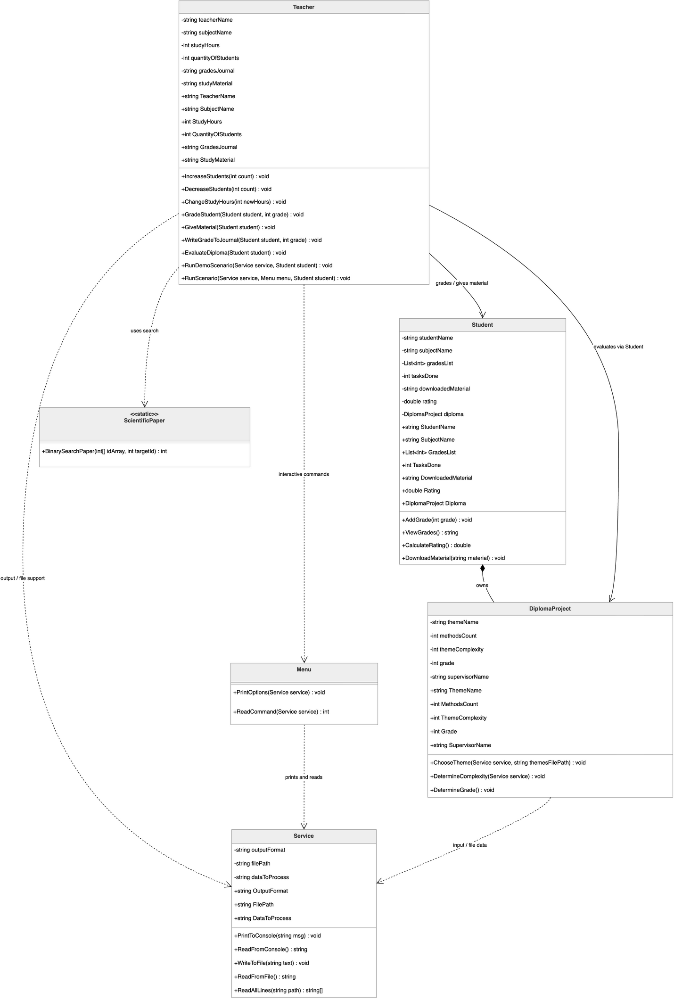
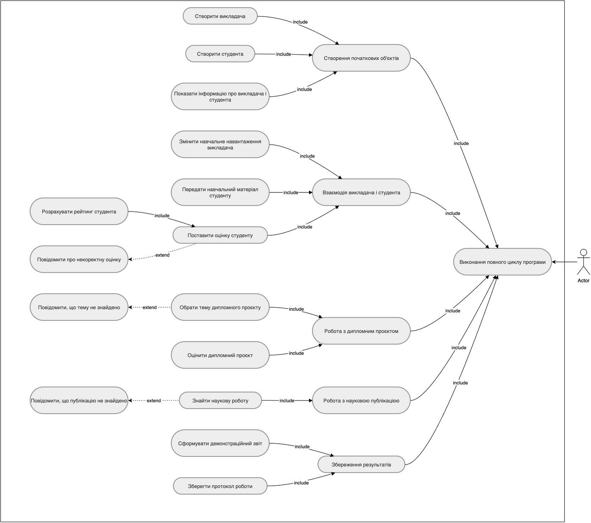
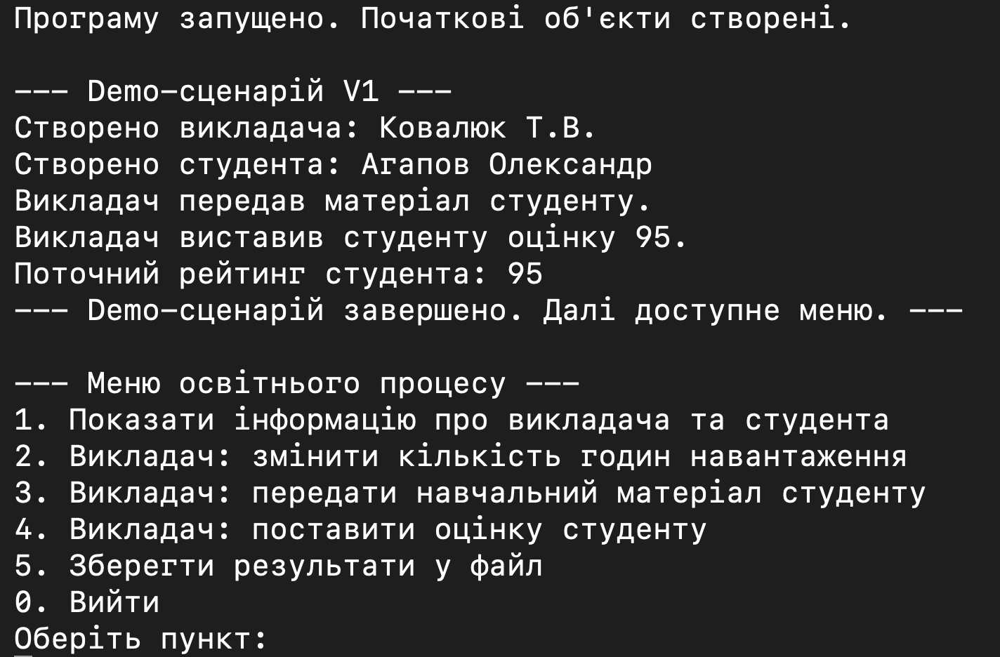
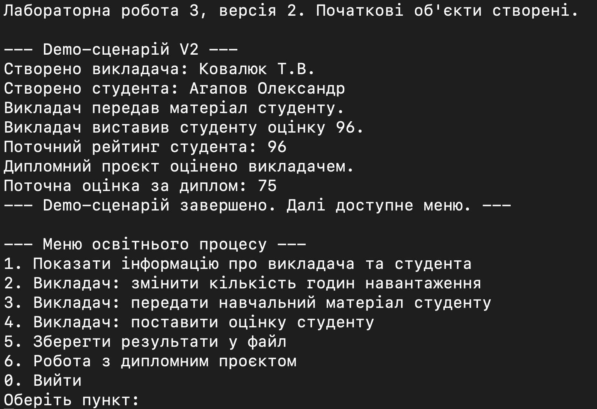
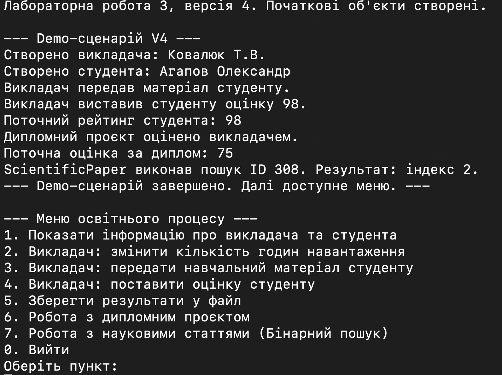

# Лабораторна робота №3

## 1. Титульна інформація

Київський національний університет імені Тараса Шевченка  
Факультет інформаційних технологій  
Кафедра програмних систем і технологій  
Дисципліна: Вступ до об'єктно-орієнтованого програмування  
Лабораторна робота №3  
Виконав: Агапов Олександр, ІПЗ-11(1), 1 курс  
Рік: 2026

## 2. Мета роботи

Метою лабораторної роботи є розроблення консольної програми мовою C# для моделювання спрощеного освітнього процесу та демонстрації базових механізмів ООП.

У роботі потрібно показати:

- власні класи та об'єкти;
- конструктори;
- інкапсуляцію через закриті поля і властивості;
- вкладений клас;
- `partial class`;
- `static class`;
- роботу з текстовими файлами;
- взаємодію предметних і технічних класів.

## 3. Умова задачі

Предметна область варіанта 1 — освітній процес. У спрощеній моделі один викладач працює з одним студентом. Фінальна версія `LAB_3_V4` демонструє:

- створення викладача і студента;
- передавання навчального матеріалу;
- виставлення оцінки;
- розрахунок рейтингу студента;
- роботу з дипломним проєктом;
- допоміжний пошук через `ScientificPaper`;
- збереження текстових результатів у файл.

## 4. Аналіз задачі / OOA

Основні предметні сутності:

- `Teacher` — викладач, який змінює навчальне навантаження, передає матеріал, оцінює студента і формує предметний сценарій роботи.
- `Student` — студент, який зберігає оцінки, кількість виконаних робіт, рейтинг, отриманий матеріал і дипломний проєкт.
- `Student.DiplomaProject` — дипломний проєкт студента з темою, складністю та оцінкою.
- `ScientificPaper` — допоміжний `static class` для демонстрації алгоритмічного пошуку, який не є окремим учасником освітньої предметної області.

Технічні класи:

- `Program` — тільки створює об'єкти і запускає сценарій.
- `Menu` — тільки показує команди і читає вибір.
- `Service` — тільки консоль, текст, протокол і файл.

## 5. Об'єктно-орієнтоване проєктування / OOD

Розвиток лабораторної за версіями:

- `LAB_3_V1` — базові класи `Teacher`, `Student`, `Service`, `Menu`, `Program`.
- `LAB_3_V2` — вкладений клас `Student.DiplomaProject` і робота з темами з текстового файлу.
- `LAB_3_V3` — `partial class Student` і винесення логіки дипломного проєкту в окремий файл.
- `LAB_3_V4` — `ScientificPaper` як `static class` і завершена фінальна архітектура.

Ключові рішення:

- `Student` реалізовано як `partial class`;
- `DiplomaProject` є вкладеним класом у `Student`;
- `Student` композиційно містить `DiplomaProject`;
- `ScientificPaper` реалізовано як `static class`;
- предметна логіка зосереджена в `Teacher`, `Student`, `DiplomaProject`, `ScientificPaper`;
- технічна логіка винесена в `Menu` і `Service`.

## 6. Графічне зображення структури програми

Фінальні діаграми для `LAB_3_V4` відображають підсумкову архітектуру лабораторної: `Program` лише створює об'єкти і запускає сценарій, `Teacher` веде demo-сценарій як предметна сутність, `Menu` виконує тільки технічне меню, а `Service` відповідає за консоль, текст, протокол і файли.

### UML діаграма класів LAB_3_V4

Діаграма класів фінальної версії LAB_3_V4 відображає предметні класи Teacher, Student, вкладений Student::DiplomaProject, ScientificPaper, а також допоміжні класи Service і Menu.

### UML діаграма використання LAB_3

Діаграма використання показує основні сценарії роботи освітнього процесу: взаємодію викладача і студента, роботу з дипломним проєктом, пошук наукової роботи та збереження результатів.

## 7. Структура програми

Фінальна версія `LAB_3_V4` містить такі файли:

- `Program.cs` — створює `Service`, `Teacher`, `Student`, `Menu` та запускає предметний сценарій.
- `Menu.cs` — містить тільки `PrintOptions(Service service)` і `ReadCommand(Service service)`.
- `Service.cs` — працює з консоллю, текстом, протоколом і файлами.
- `Teacher.cs` — містить логіку викладача і веде demo-сценарій.
- `Student.cs` — основна частина класу `Student` і вкладеного `DiplomaProject`.
- `StudentDiplomaLogic.cs` — логіка теми, складності та оцінки дипломного проєкту.
- `ScientificPaper.cs` — статичний пошук ID наукової статті.

## 8. Архітектурні зміни після перевірки реалізації

Після перевірки реалізації було виконано архітектурне уточнення та приведення структури програми до єдиного архітектурного принципу, який використано і в наступних лабораторних роботах.

Уточнення розподілу відповідальностей:

- `Program` залишено тільки як точку запуску: він створює об'єкти і запускає сценарій.
- Demo-сценарій знаходиться в `Teacher`, оскільки саме викладач є активною предметною сутністю освітнього процесу.
- `Menu` більше не керує предметною областю.
- `Menu` виконує тільки технічні функції:
  - `PrintOptions(Service service)`
  - `ReadCommand(Service service)`
- `Service` більше не керує `Teacher`, `Student`, `DiplomaProject`, `ScientificPaper`.
- `Service` працює тільки з:
  - консоллю;
  - текстом;
  - протоколом;
  - файлами.
- Предметні класи самі формують свою логіку і текстові результати, а `Service` тільки виводить або зберігає готовий текст.
- Окремий `DemoScenario` не створювався, щоб не вводити додатковий керуючий клас поза предметною областю.
- Таке рішення відповідає принципу єдиної відповідальності: предметна логіка відділена від технічної.

Після архітектурного уточнення:

- `Program` створює `Service`, `Teacher`, `Student` та інші потрібні об'єкти;
- `Teacher` веде demo-сценарій;
- `Student` відповідає за оцінки, рейтинг, матеріали та дипломний проєкт;
- `DiplomaProject` відповідає за тему, складність і оцінку дипломного проєкту;
- `ScientificPaper` відповідає за пошук / роботу з науковою статтею;
- `Menu` є тільки технічним класом;
- `Service` є тільки технічним класом.

## 9. Реалізація основних ООП-механізмів

У фінальній версії лабораторної реалізовано:

- конструктори за замовчуванням, з параметрами і копіювання;
- інкапсуляцію через приватні поля і публічні властивості;
- `partial class Student`;
- вкладений клас `Student.DiplomaProject`;
- композицію між `Student` і `DiplomaProject`;
- `static class ScientificPaper`;
- роботу з текстовими файлами через `themes.txt` і файл протоколу / звіту.

## 10. Результати виконання програми

У розділі результатів потрібно показати виконання кожної версії лабораторної роботи окремо. Якщо PNG-скріншоти ще не додано до пакета, у звіті залишаються такі плейсхолдери.

### 10.1. Результат виконання LAB_3_V1

Що показує demo-сценарій:

- базова взаємодія викладача і студента;
- створення об'єктів;
- передавання матеріалу;
- оцінювання;
- розрахунок рейтингу.

Підпис: Результат виконання demo-сценарію `LAB_3_V1`: базова взаємодія викладача і студента, створення об'єктів, передавання матеріалу, оцінювання і рейтинг.

### 10.2. Результат виконання LAB_3_V2

Що показує demo-сценарій:

- розвиток функціоналу `LAB_3_V1`;
- доповнення другої версії завдання;
- роботу з розширеною предметною логікою цієї версії.

Підпис: Результат виконання demo-сценарію `LAB_3_V2`: розвиток функціоналу `LAB_3_V1` відповідно до другої версії завдання.

### 10.3. Результат виконання LAB_3_V3

Що показує demo-сценарій:

- демонстрацію дипломного проєкту;
- додаткову логіку `Student`, винесену у partial-файли;
- послідовне виконання сценарію цієї версії.

Підпис: Результат виконання demo-сценарію `LAB_3_V3`: демонстрація дипломного проєкту і додаткової логіки студента цієї версії.

### 10.4. Результат виконання LAB_3_V4

Що показує demo-сценарій:

- фінальну версію `LAB_3`;
- основний сценарій взаємодії викладача і студента;
- дипломний проєкт;
- `ScientificPaper`;
- технічне меню після завершення demo.

Підпис: Результат виконання demo-сценарію `LAB_3_V4`: фінальна версія `LAB_3` з основним сценарієм, дипломним проєктом, `ScientificPaper` і технічним меню.

## 11. Перевірка працездатності

- `LAB_3_V1` — Build succeeded, 0 Warning(s), 0 Error(s)
- `LAB_3_V2` — Build succeeded, 0 Warning(s), 0 Error(s)
- `LAB_3_V3` — Build succeeded, 0 Warning(s), 0 Error(s)
- `LAB_3_V4` — Build succeeded, 0 Warning(s), 0 Error(s)

Фінальна версія також була запущена:

- `LAB_3_V4`

## 12. Висновок

У лабораторній роботі №3 збережено весь основний функціонал, пов'язаний з моделюванням спрощеного освітнього процесу, роботою з дипломним проєктом і допоміжним алгоритмічним пошуком. Архітектуру уточнено так, щоб предметна логіка була відокремлена від технічних класів, а `Program`, `Menu` і `Service` виконували чітко обмежені ролі.

Розміщення demo-сценарію в `Teacher` дало змогу зробити запуск програми послідовним і зручним для демонстрації на захисті. Такий підхід спрощує перевірку роботи програми і відповідає єдиному архітектурному принципу, який використовується в наступних лабораторних роботах.

## 13. Посилання на Doxygen / HTML-звіт

### Документація коду Doxygen

Для фінальної версії `LAB_3_V4` згенеровано HTML-документацію Doxygen. Вона містить перелік класів, файлів, методів, властивостей і XML-коментарів до коду.

- HTML-звіт: [final_html_report/index.html](final_html_report/index.html)
- Doxygen: [doxygen/html/index.html](doxygen/html/index.html)
