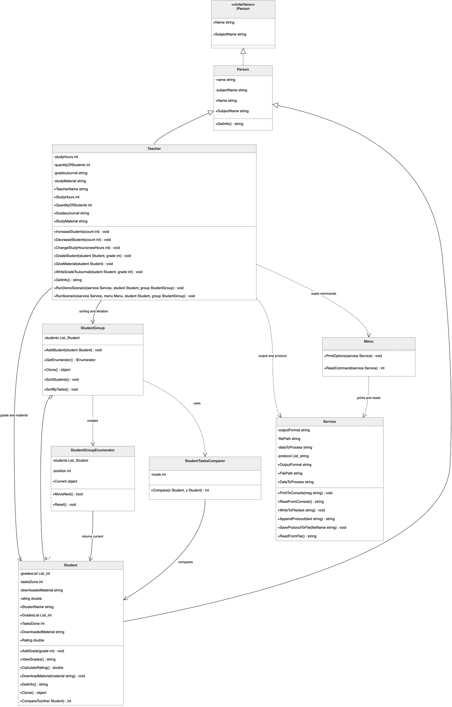
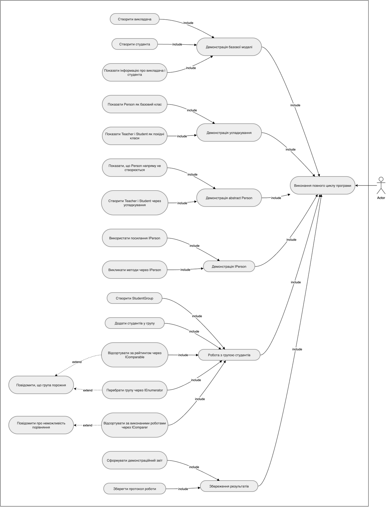
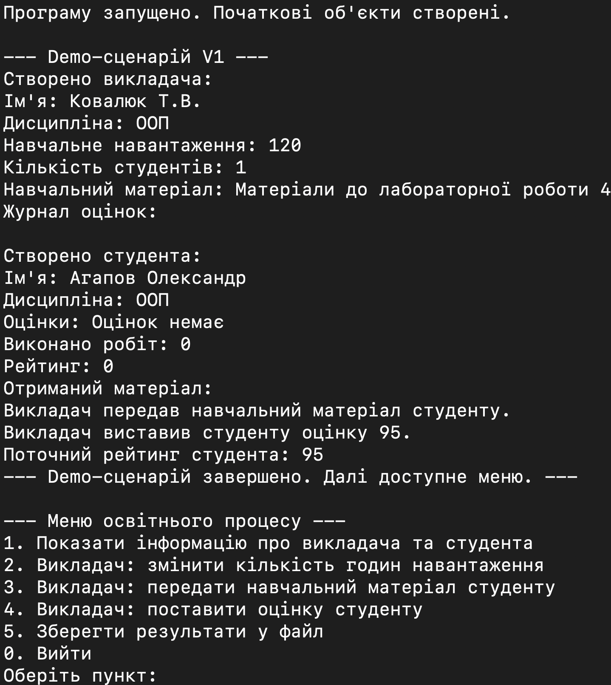
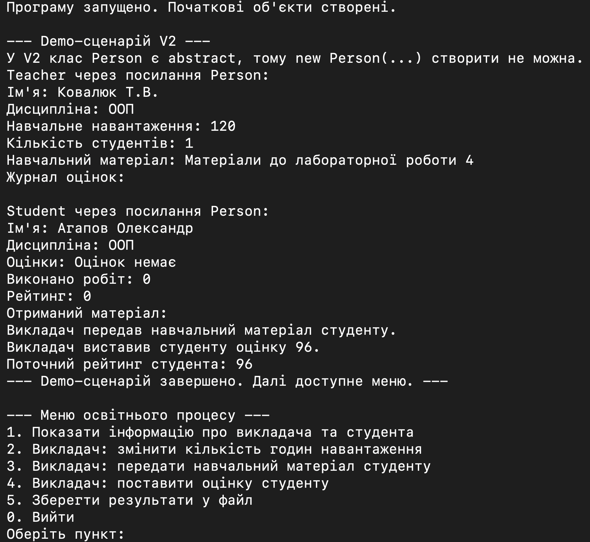
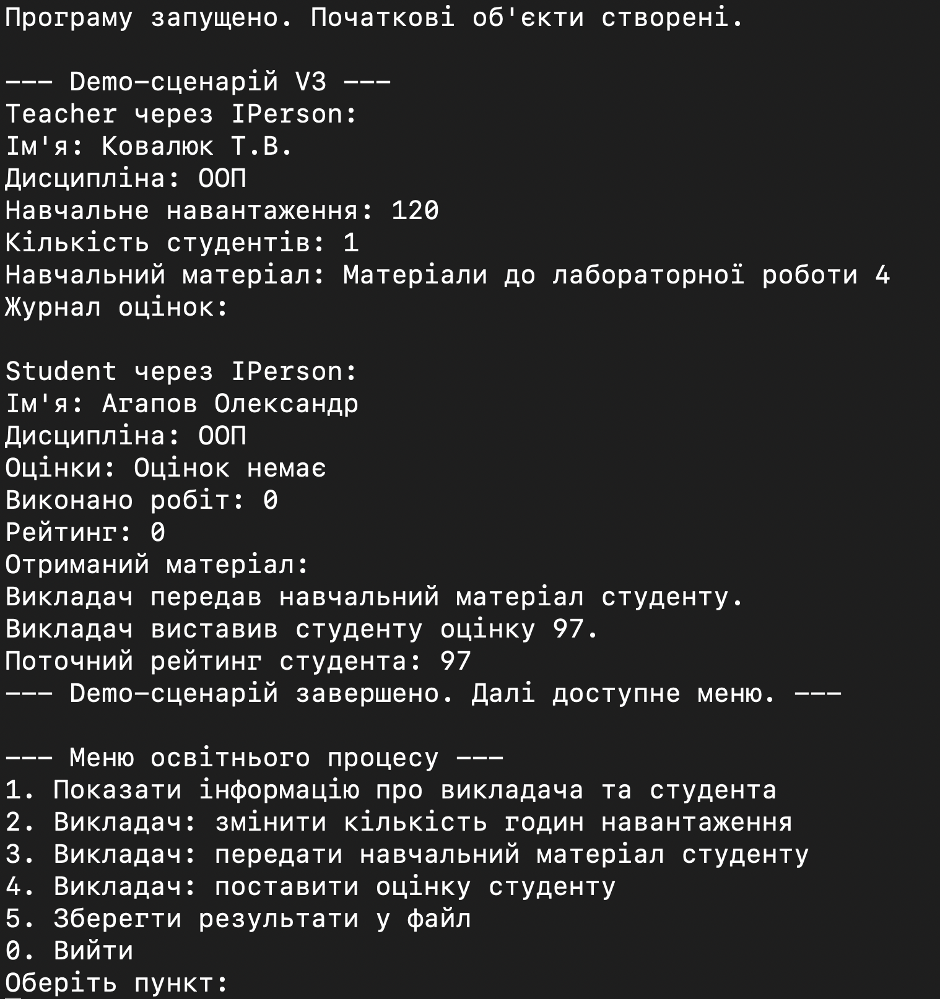
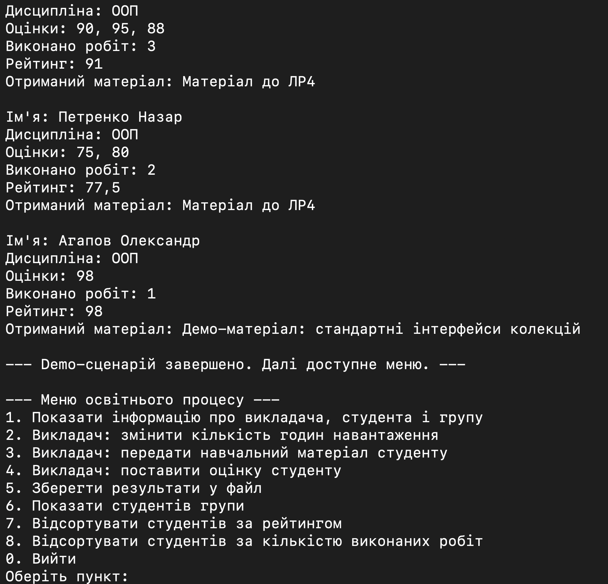

# Лабораторна робота №4

## 1. Титульна інформація

Київський національний університет імені Тараса Шевченка  
Факультет інформаційних технологій  
Кафедра програмних систем і технологій  
Дисципліна: Вступ до об'єктно-орієнтованого програмування  
Лабораторна робота №4  
Тема: Конструктори та інтерфейси  
Виконав: Агапов Олександр, ІПЗ-11(1), 1 курс  
Рік: 2026

## 2. Мета роботи

Метою лабораторної роботи є практичне опрацювання:

- успадкування;
- конструкторів базових і похідних класів;
- абстрактних класів;
- власних інтерфейсів;
- стандартних інтерфейсів .NET для порівняння, сортування і перебору.

## 3. Умова задачі

ЛР4 є логічним продовженням виправленої ЛР3 і розвиває ту саму предметну область — спрощений освітній процес.

Фінальна версія `LAB_4_V4` демонструє:

- базовий клас `Person`;
- похідні класи `Teacher` і `Student`;
- групу студентів `StudentGroup`;
- сортування через `IComparable<Student>` і `IComparer<Student>`;
- перебір через `IEnumerable` і `IEnumerator`;
- запуск програми через предметний сценарій, який веде `Teacher`.

## 4. Аналіз задачі / OOA

Предметні сутності:

- `Person` — базова узагальнена сутність людини в освітньому процесі;
- `Teacher` — викладач;
- `Student` — студент;
- `StudentGroup` — група студентів.

Допоміжні елементи реалізації:

- `IPerson` — контракт для версії `V3`;
- `StudentTasksComparer` — окремий порівнювач студентів;
- `StudentGroupEnumerator` — окремий перебирач;
- `Program`, `Menu`, `Service` — технічні класи.

## 5. Об'єктно-орієнтоване проєктування / OOD

Розвиток лабораторної за версіями:

- `LAB_4_V1` — успадкування `Person -> Teacher / Student`.
- `LAB_4_V2` — `abstract Person`.
- `LAB_4_V3` — `IPerson -> Person -> Teacher / Student`.
- `LAB_4_V4` — `StudentGroup`, `IComparable`, `IComparer`, `IEnumerable`, `IEnumerator`.

У фінальній архітектурі:

- `Teacher` і `Student` успадковують `Person`;
- `Person` у `V2` є `abstract`;
- `Person` у `V3` реалізує `IPerson`;
- `Student` у `V4` реалізує `IComparable<Student>`;
- `StudentTasksComparer` реалізує `IComparer<Student>`;
- `StudentGroup` реалізує `IEnumerable`;
- `StudentGroupEnumerator` реалізує `IEnumerator`.

## 6. Графічне зображення структури програми

Фінальні діаграми для `LAB_4_V4` побудовані вже для уточненої архітектури, де `Teacher` веде предметний сценарій, `Program` лише запускає роботу, а `Menu` і `Service` лишаються допоміжними технічними класами.

### UML діаграма класів LAB_4_V4

Діаграма класів фінальної версії LAB_4_V4 показує ієрархію Person → Teacher / Student, реалізацію стандартних інтерфейсів у класах Student, StudentGroup, StudentGroupEnumerator і StudentTasksComparer, а також допоміжні класи Service і Menu.

### UML діаграма використання LAB_4

Діаграма використання відображає сценарії демонстрації успадкування, абстрактного базового класу, інтерфейсної ієрархії та роботи з групою студентів.

## 7. Структура програми

Фінальна версія `LAB_4_V4` містить:

- `Program.cs` — створює `Service`, `Teacher`, `Student`, `StudentGroup`, `Menu` і запускає сценарій через `Teacher`;
- `Menu.cs` — містить тільки `PrintOptions(Service service)` і `ReadCommand(Service service)`;
- `Service.cs` — відповідає тільки за консоль, текст, протокол і файл;
- `Person.cs` — базовий клас;
- `IPerson.cs` — інтерфейс для `V3`;
- `Teacher.cs` — предметна логіка викладача і demo-сценарій;
- `Student.cs` — логіка студента і `IComparable<Student>`;
- `StudentGroup.cs` — група студентів і `IEnumerable`;
- `StudentGroupEnumerator.cs` — `IEnumerator`;
- `StudentTasksComparer.cs` — `IComparer<Student>`.

## 8. Архітектурні зміни після перевірки реалізації

Після перевірки реалізації було виконано архітектурне уточнення та приведення структури програми до єдиного архітектурного принципу.

Уточнення розподілу відповідальностей:

- `Program` залишено тільки як точку запуску: він створює об'єкти і запускає сценарій.
- Demo-сценарій знаходиться в `Teacher`, бо викладач є активною предметною сутністю освітнього процесу.
- `Menu` більше не керує предметною областю.
- `Menu` виконує тільки технічні функції:
  - `PrintOptions(Service service)`
  - `ReadCommand(Service service)`
- `Service` більше не керує `Teacher`, `Student`, `StudentGroup`.
- `Service` працює тільки з:
  - консоллю;
  - текстом;
  - протоколом;
  - файлами.
- Предметні класи самі формують свою логіку і текстові результати, а `Service` тільки виводить або зберігає готовий текст.
- Окремий `DemoScenario` не створювався, щоб не вводити додатковий керуючий клас поза предметною областю.
- Таке рішення відповідає принципу єдиної відповідальності: предметна логіка відділена від технічної.

Після архітектурного уточнення:

- ЛР4 базується на виправленій ЛР3;
- `Program` створює об'єкти і запускає сценарій через `Teacher`;
- `Teacher` веде demo-сценарій;
- `Menu` не має `Teacher`, `Student`, `StudentGroup` як полів;
- `Service` не керує предметними об'єктами;
- у `V1` збережено успадкування `Person -> Teacher / Student`;
- у `V2` збережено `abstract Person`;
- у `V3` збережено `IPerson -> Person -> Teacher / Student`;
- у `V4` збережено `IComparable`, `IComparer`, `IEnumerable`, `IEnumerator`.

## 9. Реалізація основних ООП-механізмів

У лабораторній роботі №4 продемонстровано:

- успадкування;
- `protected` конструктори;
- абстрактний клас;
- інтерфейсний поліморфізм;
- стандартні інтерфейси порівняння і перебору;
- роботу з групою студентів як окремою колекційною сутністю.

## 10. Результати виконання програми

У розділі результатів потрібно показати виконання кожної версії лабораторної роботи окремо. Якщо PNG-скріншоти ще не додано до пакета, у звіті залишаються такі плейсхолдери.

### 10.1. Результат виконання LAB_4_V1

Що показує demo-сценарій:

- успадкування `Person -> Teacher / Student`;
- створення базових об'єктів;
- роботу початкової версії предметної моделі.

Підпис: Результат виконання demo-сценарію `LAB_4_V1`: демонстрація успадкування `Person -> Teacher / Student`.

### 10.2. Результат виконання LAB_4_V2

Що показує demo-сценарій:

- використання `abstract Person`;
- збереження предметної логіки в похідних класах;
- виконання другої версії лабораторної роботи.

Підпис: Результат виконання demo-сценарію `LAB_4_V2`: демонстрація `abstract Person`.

### 10.3. Результат виконання LAB_4_V3

Що показує demo-сценарій:

- ієрархію `interface -> Person -> Teacher / Student`;
- поліморфізм через `IPerson`;
- розвиток архітектури третьої версії.

Підпис: Результат виконання demo-сценарію `LAB_4_V3`: демонстрація ієрархії `interface -> Person -> Teacher / Student`.

### 10.4. Результат виконання LAB_4_V4

Що показує demo-сценарій:

- `StudentGroup`;
- `IComparable`;
- `IComparer`;
- `IEnumerable`;
- `IEnumerator`.

Підпис: Результат виконання demo-сценарію `LAB_4_V4`: демонстрація `StudentGroup`, `IComparable`, `IComparer`, `IEnumerable`, `IEnumerator`.

## 11. Перевірка працездатності

- `LAB_4_V1` — Build succeeded, 0 Warning(s), 0 Error(s)
- `LAB_4_V2` — Build succeeded, 0 Warning(s), 0 Error(s)
- `LAB_4_V3` — Build succeeded, 0 Warning(s), 0 Error(s)
- `LAB_4_V4` — Build succeeded, 0 Warning(s), 0 Error(s)

Фінальна версія також була запущена:

- `LAB_4_V4`

## 12. Висновок

У лабораторній роботі №4 збережено весь основний функціонал, пов'язаний зі спадкуванням, абстракцією, інтерфейсами і стандартними інтерфейсами .NET для роботи з групою студентів. Архітектуру уточнено так, щоб предметна логіка була відокремлена від технічних класів, а `Program`, `Menu` і `Service` мали чітко визначені ролі.

Розміщення demo-сценарію в `Teacher` дозволяє швидко перевірити роботу програми при запуску і зручно пояснити її на захисті. Така структура логічно продовжує виправлену ЛР3 і готує основу для ЛР5.

## 13. Посилання на Doxygen / HTML-звіт

### Документація коду Doxygen

Для фінальної версії `LAB_4_V4` згенеровано HTML-документацію Doxygen. Вона містить перелік класів, файлів, методів, властивостей і XML-коментарів до коду.

- HTML-звіт: [final_html_report/index.html](final_html_report/index.html)
- Doxygen: [doxygen/html/index.html](doxygen/html/index.html)
