# Лабораторна робота №5

## 1. Титульна інформація

Київський національний університет імені Тараса Шевченка  
Факультет інформаційних технологій  
Кафедра програмних систем і технологій  
Дисципліна: Вступ до об'єктно-орієнтованого програмування  
Лабораторна робота №5  
Тема: Поліморфізм методів і операторів, індексатори та копії об'єктів  
Виконав: Агапов Олександр, ІПЗ-11(1), 1 курс  
Рік: 2026

## 2. Мета роботи

Метою лабораторної роботи є практичне опанування:

- динамічного поліморфізму;
- перевантаження операторів;
- індексаторів;
- конструктора копіювання.

## 3. Умова задачі

ЛР5 є логічним продовженням виправленої ЛР4 і зберігає ту саму предметну область — спрощений освітній процес.

Версії лабораторної:

- `LAB_5_V1` — dynamic polymorphism через `Person`, `Teacher`, `Student`;
- `LAB_5_V2` — operator overloading у `Teacher`, `Student`, `DiplomaProject`;
- `LAB_5_V3` — `StudentGroup`, індексатор і copy constructor `DiplomaProject`.

Фінальна версія для аналізу у звіті — `LAB_5_V3`.

## 4. Аналіз задачі / OOA

Основні предметні сутності:

- `Person` — абстрактна базова сутність;
- `Teacher` — викладач;
- `Student` — студент;
- `DiplomaProject` — дипломний проєкт;
- `StudentGroup` — група студентів у `V3`.

Технічні класи:

- `Program` — тільки створює об'єкти і запускає сценарій;
- `Menu` — тільки показує команди і читає вибір;
- `Service` — тільки консоль, текст, протокол і файл.

## 5. Об'єктно-орієнтоване проєктування / OOD

Ключові рішення:

- `Person` збережено як `abstract class`;
- `Teacher` і `Student` успадковують `Person`;
- `Teacher`, `Student`, `DiplomaProject` містять перевантажені оператори;
- `StudentGroup` у `V3` містить `Count`, `AddStudent(Student)`, індексатор `this[int index]`;
- `DiplomaProject(DiplomaProject other)` копіює основні поля, але створює копію без оцінки (`Mark = 0`);
- предметна логіка залишається в предметних класах, а технічна — в `Service` і `Menu`.

## 6. Графічне зображення структури програми

Фінальні діаграми для `LAB_5_V3` уже відображають підсумкову архітектуру лабораторної: `Program` лише запускає сценарій, `Teacher` веде предметний demo-сценарій, а `Menu` і `Service` не керують предметною областю.

### UML діаграма класів LAB_5_V3

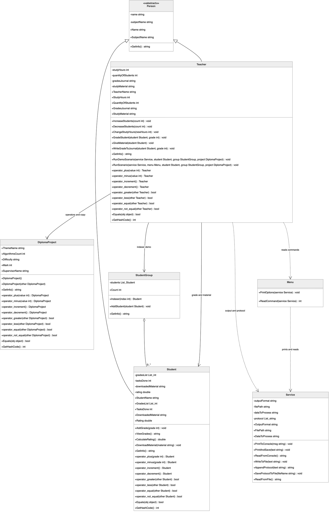

Діаграма класів фінальної версії LAB_5_V3 показує abstract Person, похідні класи Teacher і Student, клас DiplomaProject з перевантаженими операторами та конструктором копіювання, StudentGroup з індексатором, а також Service і Menu.

### UML діаграма використання LAB_5

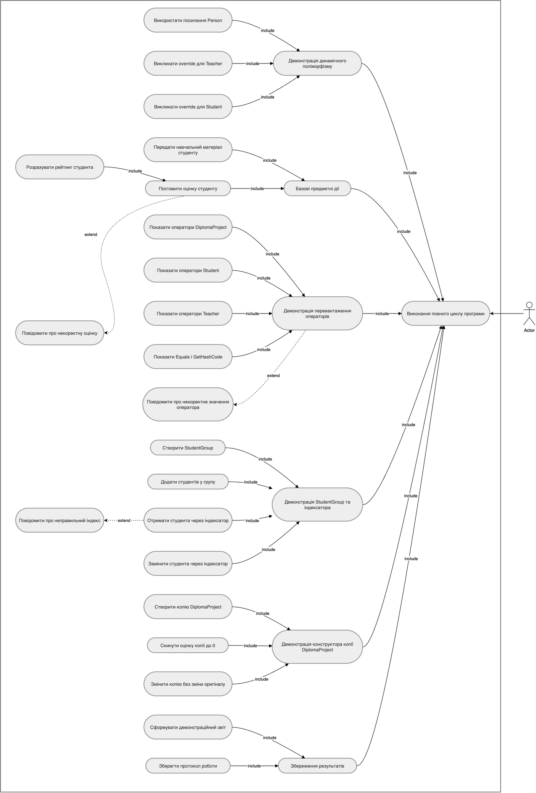

Діаграма використання показує сценарії динамічного поліморфізму, перевантаження операторів, роботи з StudentGroup, індексатором і конструктором копіювання DiplomaProject.

### UML діаграма діяльності LAB_5

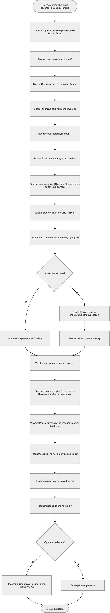

Діаграма діяльності описує сценарій роботи з StudentGroup, індексатором, обробкою неправильного індексу та створенням копії DiplomaProject.

### UML діаграма послідовності LAB_5

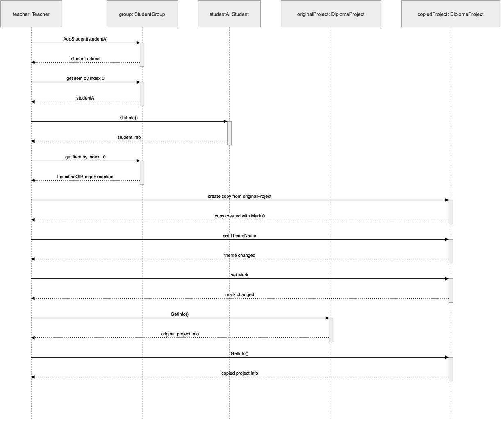

Діаграма послідовності показує предметну взаємодію Teacher, StudentGroup, Student і DiplomaProject без технічних класів Program, Menu і Service.

## 7. Структура програми

Фінальна версія `LAB_5_V3` містить:

- `Program.cs` — створює об'єкти і запускає сценарій через `Teacher`;
- `Menu.cs` — містить тільки `PrintOptions(Service service)` і `ReadCommand(Service service)`;
- `Service.cs` — працює тільки з консоллю, текстом, протоколом і файлами;
- `Person.cs` — абстрактний базовий клас;
- `Teacher.cs` — містить предметну логіку викладача і demo-сценарій;
- `Student.cs` — містить логіку студента і перевантажені оператори;
- `DiplomaProject.cs` — містить перевантажені оператори і конструктор копіювання;
- `StudentGroup.cs` — група студентів та індексатор.

## 8. Архітектурні зміни після перевірки реалізації

Після перевірки реалізації було виконано архітектурне уточнення та приведення структури програми до єдиного архітектурного принципу.

Уточнення розподілу відповідальностей:

- `Program` залишено тільки як точку запуску: він створює об'єкти і запускає сценарій.
- Demo-сценарій знаходиться в `Teacher`, бо викладач є активною предметною сутністю освітнього процесу.
- `Menu` більше не керує предметною областю.
- `Menu` виконує тільки технічні функції:
  - `PrintOptions(Service service)`
  - `ReadCommand(Service service)`
- `Service` більше не керує `Teacher`, `Student`, `DiplomaProject`, `StudentGroup`.
- `Service` працює тільки з:
  - консоллю;
  - текстом;
  - протоколом;
  - файлами.
- Предметні класи самі формують свою логіку і текстові результати, а `Service` тільки виводить або зберігає готовий текст.
- Окремий `DemoScenario` не створювався, щоб не вводити додатковий керуючий клас поза предметною областю.
- Таке рішення відповідає принципу єдиної відповідальності: предметна логіка відділена від технічної.

Після архітектурного уточнення:

- ЛР5 базується на виправленій ЛР4;
- `Program` створює об'єкти і запускає сценарій через `Teacher`;
- `Teacher` веде demo-сценарій;
- `Menu` не керує `Teacher`, `Student`, `DiplomaProject`, `StudentGroup`;
- `Service` не керує предметними класами;
- у `V1` збережено dynamic polymorphism через `abstract Person` і `override` у `Teacher` / `Student`;
- у `V2` збережено operator overloading у `Teacher`, `Student`, `DiplomaProject`;
- у `V3` збережено `StudentGroup`, indexer і copy constructor `DiplomaProject`;
- copy constructor `DiplomaProject` створює копію з основними даними, але без оцінки / `Mark = 0`.

## 9. Реалізація основних ООП-механізмів

У лабораторній роботі №5 продемонстровано:

- dynamic polymorphism через `virtual` / `override`;
- operator overloading у предметних класах;
- узгодження `==` / `!=` з `Equals()` і `GetHashCode()`;
- `StudentGroup` з індексатором;
- `DiplomaProject` з конструктором копіювання.

## 10. Результати виконання програми

У розділі результатів показано виконання кожної версії лабораторної роботи окремо. До пакета звіту додано фінальні PNG-скріншоти demo-сценаріїв.

### 10.1. Результат виконання LAB_5_V1

Що показує demo-сценарій:

- dynamic polymorphism через `Person -> Teacher / Student`;
- використання `override` у предметних класах;
- базову логіку першої версії.

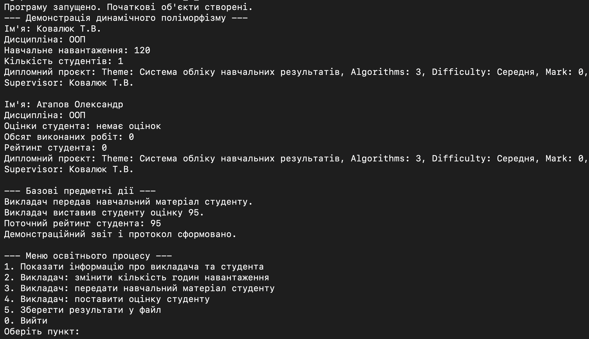

Підпис: Результат виконання demo-сценарію `LAB_5_V1`: демонстрація dynamic polymorphism через `Person -> Teacher / Student`.

### 10.2. Результат виконання LAB_5_V2

Що показує demo-сценарій:

- operator overloading у `Teacher`;
- operator overloading у `Student`;
- operator overloading у `DiplomaProject`.

Підпис: Результат виконання demo-сценарію `LAB_5_V2`: демонстрація динамічного поліморфізму та статичного поліморфізму через перевантаження операторів у класах `DiplomaProject`, `Student` і `Teacher`. Через великий обсяг виводу результат подано кількома скріншотами.

Частина 1:

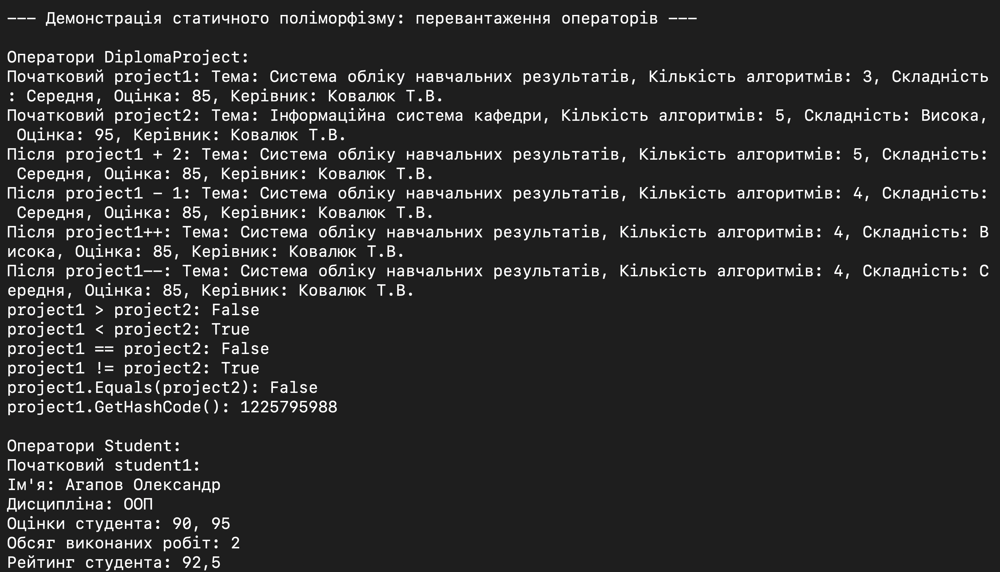

Частина 2:

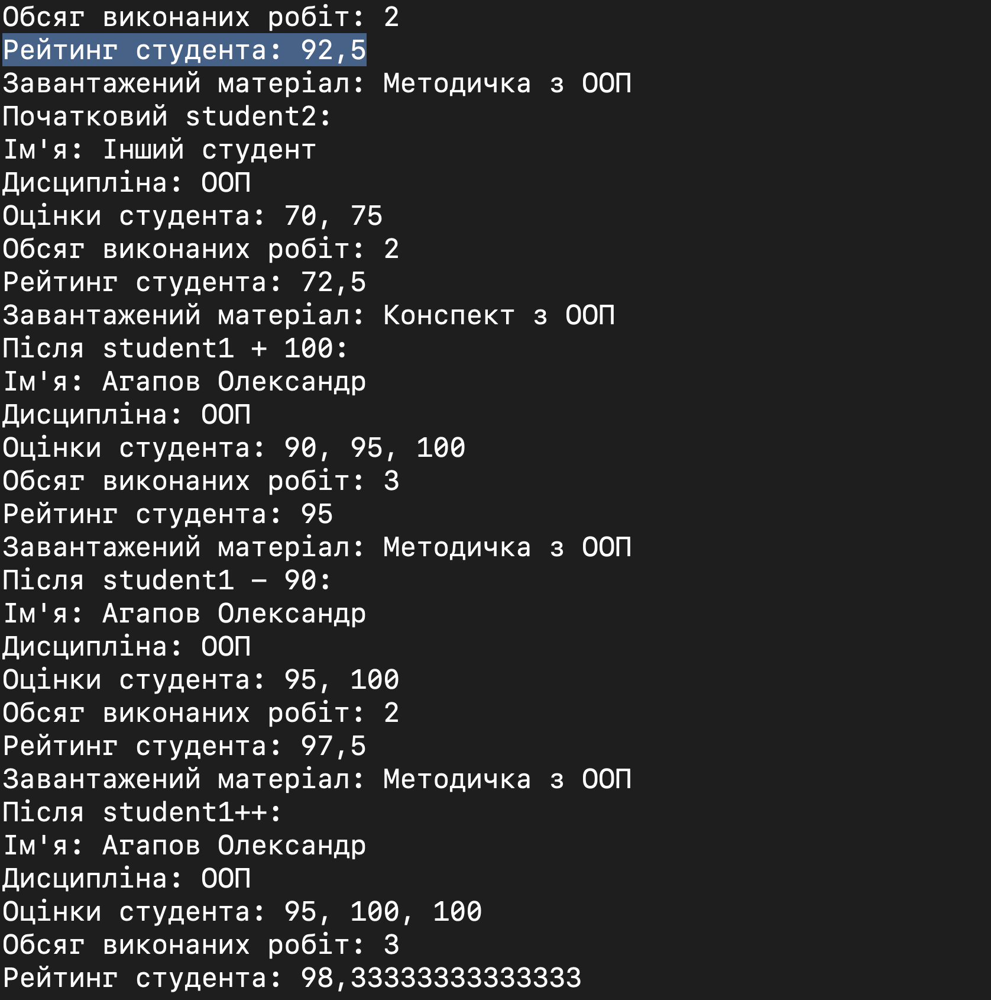

Частина 3:

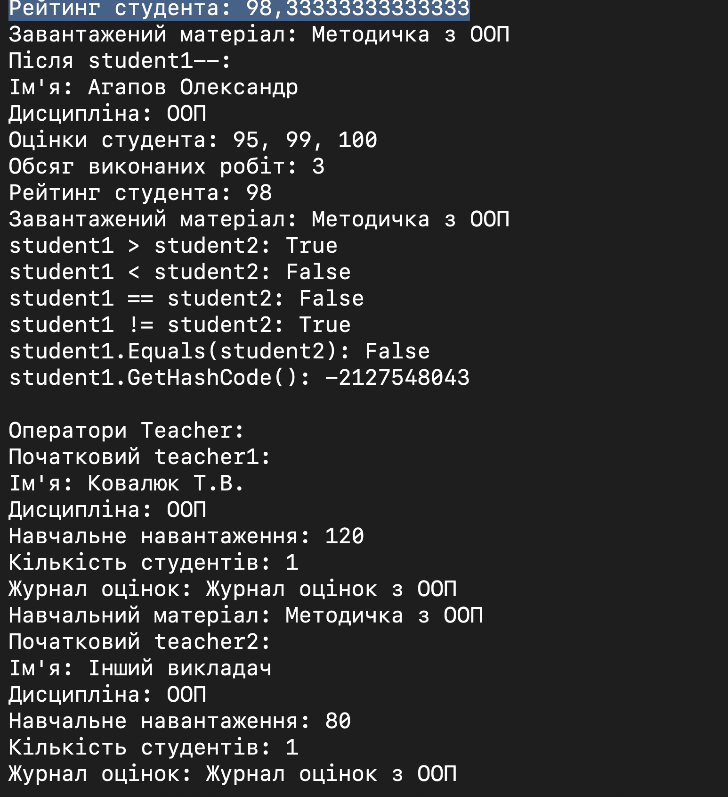

Частина 4:

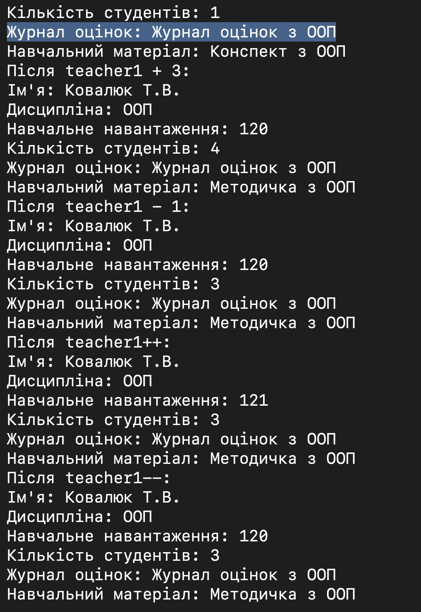

Частина 5:

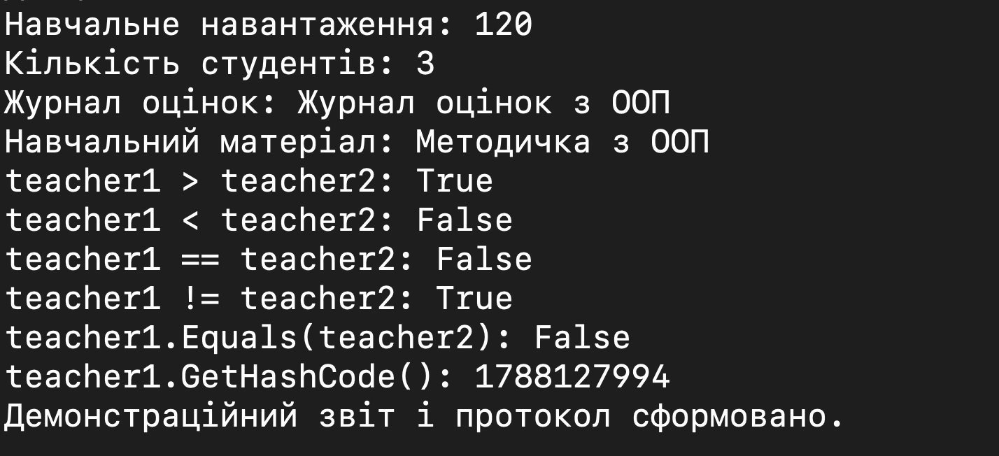

### 10.3. Результат виконання LAB_5_V3

Що показує demo-сценарій:

- `StudentGroup`;
- indexer;
- неправильний індекс;
- copy constructor `DiplomaProject`.

Підпис: Результат виконання demo-сценарію `LAB_5_V3`: демонстрація динамічного поліморфізму, перевантаження операторів, `StudentGroup`, індексатора, обробки неправильного індексу та конструктора копіювання `DiplomaProject`. Через великий обсяг виводу результат подано кількома скріншотами.

Частина 1:

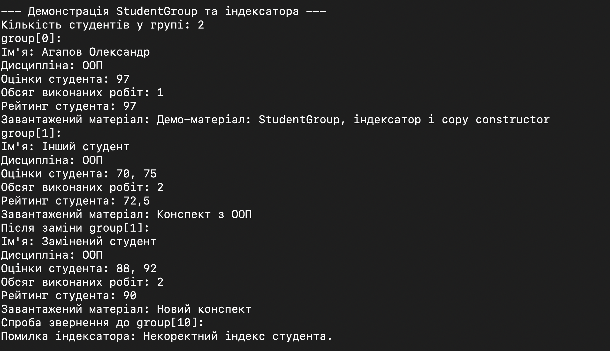

Частина 2:

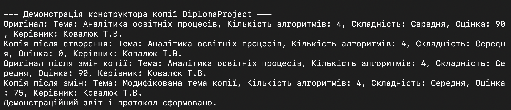

## 11. Перевірка працездатності

- `LAB_5_V1` — Build succeeded, 0 Warning(s), 0 Error(s)
- `LAB_5_V2` — Build succeeded, 0 Warning(s), 0 Error(s)
- `LAB_5_V3` — Build succeeded, 0 Warning(s), 0 Error(s)

Фінальна версія також була запущена:

- `LAB_5_V3`

## 12. Висновок

У лабораторній роботі №5 збережено весь основний функціонал, пов'язаний з динамічним поліморфізмом, перевантаженням операторів, індексатором і конструктором копіювання. Архітектуру уточнено так, щоб предметна логіка була відокремлена від технічних класів, а `Program`, `Menu` і `Service` виконували чітко обмежені ролі.

Розміщення demo-сценарію в `Teacher` дає змогу швидко перевірити роботу програми при запуску і компактно продемонструвати всі ключові механізми `V1-V3`. Такий підхід зберігає логічну спадковість від ЛР4 і робить фінальну версію зручною для захисту.

## 13. Посилання на Doxygen / HTML-звіт

### Документація коду Doxygen

Для фінальної версії `LAB_5_V3` згенеровано HTML-документацію Doxygen. Вона містить перелік класів, файлів, методів, властивостей і XML-коментарів до коду.

- HTML-звіт: [final_html_report/index.html](final_html_report/index.html)
- Doxygen: [doxygen/html/index.html](doxygen/html/index.html)
