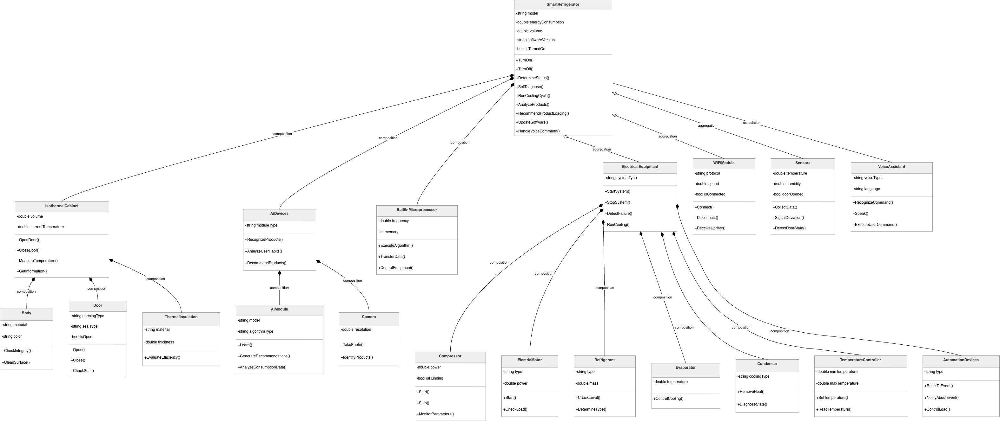
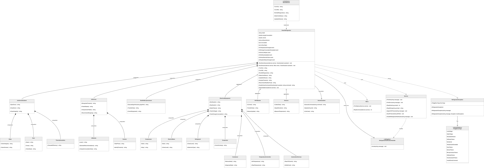
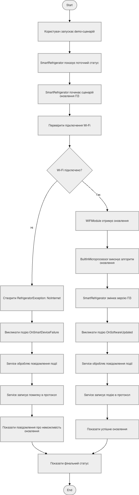
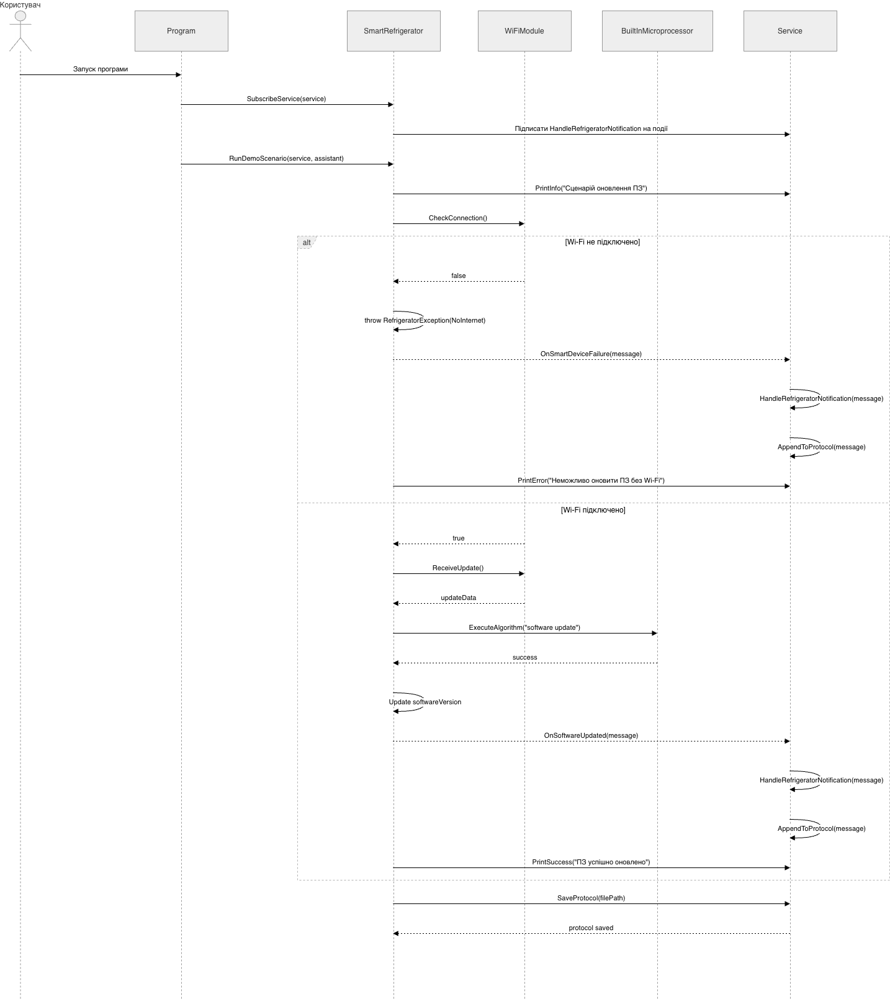
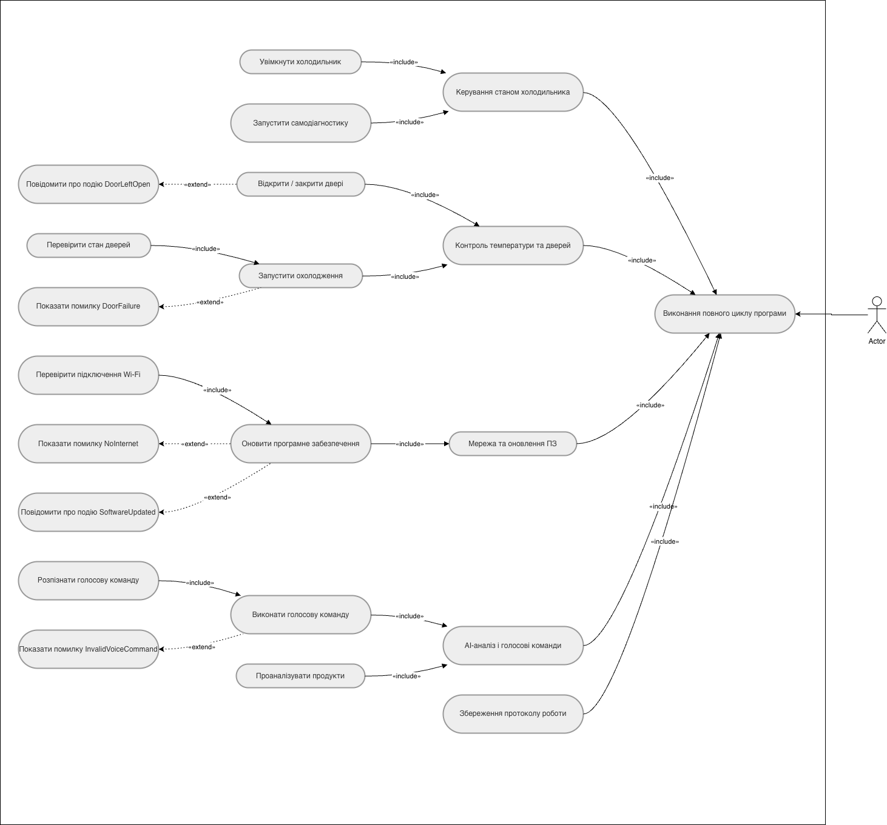

# Лабораторна робота №6

## 1. Титульна інформація

Київський національний університет імені Тараса Шевченка  
Факультет інформаційних технологій  
Кафедра програмних систем і технологій  
Дисципліна: Вступ до об'єктно-орієнтованого програмування  

Лабораторна робота №6  
Тема: Розумний холодильник  
Виконав: Агапов Олександр, ІПЗ-11(1), 1 курс  
Варіант: 1  
Рік: 2026

## 2. Мета роботи

Метою лабораторної роботи є підсумувати знання, здобуті в попередніх лабораторних роботах, та реалізувати консольну програму мовою C#, яка демонструє об'єктно-орієнтовану модель предметної області.

У межах лабораторної роботи необхідно:

- реалізувати взаємодію класів у вигляді композиції, агрегації та асоціації;
- навчитися моделювати поведінку системи через взаємодію підсистем;
- навчитися визначати та обробляти виняткові ситуації предметної області;
- навчитися програмувати події та їх обробники;
- виконати об'єктно-орієнтований аналіз і об'єктно-орієнтоване проєктування;
- підготувати UML-діаграми та документувати реалізоване рішення.

## 3. Умова задачі

Необхідно розробити консольну програму для моделювання системи "Розумний холодильник". Програма має відображати роботу побутового пристрою, який не лише підтримує базове охолодження, а й взаємодіє з користувачем, аналізує стан внутрішньої камери, оновлює програмне забезпечення та реагує на події і аварійні ситуації.

Система містить такі основні підсистеми:

- `IsothermalCabinet` — модель холодильної камери;
- `ElectricalEquipment` — система охолодження та електрообладнання;
- `BuiltInMicroprocessor` — внутрішня логіка керування;
- `AiDevices` — AI-підсистема для аналізу продуктів і рекомендацій;
- `WiFiModule` — підключення до мережі та оновлення ПЗ;
- `Sensors` — збір параметрів середовища;
- `VoiceAssistant` — голосова взаємодія з користувачем.

Проєкт реалізовано інкрементально у чотирьох версіях:

- `LAB_6_V1` — Composition / Aggregation / Association;
- `LAB_6_V2` — Interface;
- `LAB_6_V3` — Custom Exceptions;
- `LAB_6_V4` — Delegates & Events.

## 4. Аналіз предметної області

Предметна область лабораторної роботи описує роботу розумного холодильника як багатокомпонентної системи. Головна сутність моделі — `SmartRefrigerator`, яка координує кілька підсистем і надає користувачу єдиний інтерфейс для взаємодії з холодильником.

`SmartRefrigerator` не є простим контейнером даних. Він відповідає за інтеграцію роботи внутрішньої камери, системи охолодження, мікропроцесора, AI-модуля, мережевого підключення та голосового асистента. Саме тому ця сутність є центром предметної моделі.

Фізична частина холодильника представлена класом `IsothermalCabinet`. Вона моделює внутрішню камеру, двері, корпус і теплоізоляцію. З точки зору користувача саме ця частина відображає стан дверей і температуру всередині холодильника.

Клас `ElectricalEquipment` моделює систему охолодження. У ньому зібрані компресор, електродвигун, хладагент, випарник, конденсатор, терморегулятор та автоматика. Ця підсистема відповідає за фізичний запуск охолодження і підтримку температурного режиму.

`WiFiModule` відповідає за мережеве підключення і сценарії оновлення програмного забезпечення. Через нього програма демонструє ситуації як нормальної роботи, так і аварійного сценарію `NoInternet`.

`Sensors` моделює вимірювальні елементи системи: температуру, вагу продуктів, вологість та інші параметри, необхідні для діагностики і логіки контролю.

AI-функціональність моделюється через `AiDevices`, які включають `AiModule` і `Camera`. Ця підсистема відповідає за аналіз вмісту холодильника, формування рекомендацій і демонструє залежність інтелектуальних функцій від актуальної версії програмного забезпечення.

`VoiceAssistant` реалізує голосову взаємодію з користувачем. Через нього можна подавати команди, а також демонструвати окремі виняткові ситуації, пов'язані з помилками помічника або неправильними командами.

Окремо від предметної області існують технічні класи:

- `Program` — точка входу, де створюються початкові об'єкти;
- `Menu` — консольний сценарій взаємодії користувача з програмою;
- `Service` — введення, виведення, логування і збереження протоколу.

Класи `Program`, `Menu`, `Service` не є частинами холодильника. Вони потрібні для організації сценарію виконання програми, але не описують саму предметну систему.

## 5. Об'єктно-орієнтований аналіз / OOA

На етапі об'єктно-орієнтованого аналізу було виділено головні сутності предметної області, їх властивості, поведінку та зв'язки.

Основні сутності:

- `SmartRefrigerator` — модель усього пристрою;
- `IsothermalCabinet` — холодова камера;
- `ElectricalEquipment` — охолоджувальна система;
- `BuiltInMicroprocessor` — внутрішня логіка та діагностика;
- `AiDevices` — інтелектуальні функції аналізу;
- `WiFiModule` — мережеве підключення;
- `Sensors` — збір показників;
- `VoiceAssistant` — взаємодія з користувачем.

Основні атрибути системи:

- модель холодильника;
- об'єм;
- енергоспоживання;
- стан живлення;
- версія програмного забезпечення;
- температура всередині камери;
- стан дверей;
- стан мережевого підключення;
- показники сенсорів;
- статус AI-аналізу.

Основні операції системи:

- увімкнення і вимкнення холодильника;
- запуск самодіагностики;
- запуск охолодження;
- вимірювання температури;
- аналіз продуктів;
- формування рекомендацій;
- підключення Wi-Fi;
- оновлення програмного забезпечення;
- обробка голосової команди;
- збереження протоколу.

У предметній моделі використовуються три ключові типи зв'язків.

**Композиція** використовується там, де частина належить контейнеру і створюється ним самим. У цій роботі композицією є:

- `SmartRefrigerator` -> `IsothermalCabinet`, `BuiltInMicroprocessor`, `AiDevices`;
- `IsothermalCabinet` -> `Body`, `Door`, `ThermalInsulation`;
- `ElectricalEquipment` -> `Compressor`, `ElectricMotor`, `Refrigerant`, `Evaporator`, `Condenser`, `TemperatureController`, `AutomationDevices`;
- `AiDevices` -> `AiModule`, `Camera`.

**Агрегація** використовується там, де окремі технічні модулі створюються зовні й передаються головному об'єкту. У цій роботі агрегацією є:

- `Program` створює `ElectricalEquipment`, `WiFiModule`, `Sensors`;
- ці об'єкти передаються в `SmartRefrigerator` через конструктор.

**Асоціація** використовується для слабкого зв'язку без володіння життєвим циклом. У цій роботі асоціацією є:

- `VoiceAssistant` створюється окремо;
- `SmartRefrigerator` працює з ним через метод `HandleVoiceCommand(...)`.

`Service` і `Menu` не входять до предметної моделі, оскільки не описують холодильник як систему. Вони лише організовують взаємодію користувача з програмою.

## 6. Об'єктно-орієнтоване проєктування / OOD

На етапі проєктування результати OOA були перенесені у структуру консольного C#-проєкту. Кожен основний клас винесено в окремий файл, що відповідає як вимогам методички, так і практиці акуратної організації коду.

У фінальній реалізації `SmartRefrigerator` виступає центральним координатором підсистем. Він не займається файловим введенням/виведенням і не повинен безпосередньо працювати з консоллю. Його роль полягає в координації роботи внутрішніх компонентів та в управлінні доменною поведінкою холодильника.

`Service` винесено в окремий технічний клас для введення, виведення, накопичення протоколу і запису його у файл. Таке рішення дозволяє не змішувати бізнес-логіку холодильника з консольним сценарієм і файловими операціями.

`Menu` виконує роль маршрутизатора команд. Воно не реалізує предметну логіку самостійно, а лише приймає вибір користувача, викликає відповідні методи `SmartRefrigerator` і, у версіях `V3/V4`, перехоплює доменні винятки.

`Program` виступає як точка складання системи. Саме в `Program` створюються агреговані об'єкти `ElectricalEquipment`, `WiFiModule`, `Sensors`, а також `Service`, `VoiceAssistant` і `SmartRefrigerator`. Після цього програма передає їх у `Menu` і запускає сценарій взаємодії.

Проєктування виконано інкрементально:

- `V1` формує базову предметну модель і типи зв'язків;
- `V2` додає інтерфейс як контракт поведінки;
- `V3` додає доменні винятки та безпечну обробку помилок;
- `V4` додає події та делегат для реакції на зміни стану системи.

Такий підхід відповідає ідеї покрокового ускладнення програмного продукту: кожна нова версія спирається на попередню й додає новий механізм ООП без руйнування вже реалізованої моделі.

## 7. Опис реалізації `LAB_6_V1`

У версії `LAB_6_V1` реалізовано базову предметну модель "розумного холодильника" та три основні типи зв'язків між класами: композицію, агрегацію й асоціацію. Також у цій версії побудовано базове меню взаємодії та механізм збереження протоколу в текстовий файл.

### 7.1. Composition

Композиція реалізована в кількох рівнях моделі.

Клас `SmartRefrigerator` сам створює власні внутрішні підсистеми:

- `IsothermalCabinet`;
- `BuiltInMicroprocessor`;
- `AiDevices`.

Це означає, що ці об'єкти є невід'ємною частиною холодильника і логічно існують лише в межах його життєвого циклу.

Клас `IsothermalCabinet` також формує свою внутрішню структуру самостійно:

- `Body`;
- `Door`;
- `ThermalInsulation`.

Клас `ElectricalEquipment` композиційно містить технічні елементи охолоджувальної системи:

- `Compressor`;
- `ElectricMotor`;
- `Refrigerant`;
- `Evaporator`;
- `Condenser`;
- `TemperatureController`;
- `AutomationDevices`.

Клас `AiDevices` композиційно включає:

- `AiModule`;
- `Camera`.

Таким чином, композиція в `V1` показує жорстко пов'язані частини системи, які створюються контейнером і концептуально не існують поза ним.

### 7.2. Aggregation

Агрегація у `V1` реалізована через конструктор `SmartRefrigerator`. У `Program.cs` окремо створюються:

- `ElectricalEquipment`;
- `WiFiModule`;
- `Sensors`.

Після цього вони передаються у `SmartRefrigerator` як готові зовнішні об'єкти. Це означає, що холодильник працює з ними, але не є джерелом їх створення у головному сценарії запуску програми. Саме така схема відповідає агрегації.

### 7.3. Association

Асоціація у `V1` показана через `VoiceAssistant`. Голосовий помічник створюється окремо в `Program.cs` і не зберігається як внутрішня частина холодильника. `SmartRefrigerator` використовує його лише під час виконання методу `HandleVoiceCommand(...)`.

Тобто між холодильником і асистентом існує зв'язок взаємодії, але немає жорсткого володіння життєвим циклом. Це і є класична асоціація.

### 7.4. Menu / Service / Protocol

У `V1` побудовано базове консольне меню через клас `Menu`. Воно показує доступні команди, приймає вибір користувача і викликає відповідні методи холодильника.

Клас `Service` відповідає за:

- виведення повідомлень у консоль;
- введення даних;
- накопичення рядків протоколу;
- збереження протоколу у файл.

Таким чином, уже в першій версії закладено правильне розмежування між предметною логікою і технічними операціями введення/виведення.

## 8. Опис реалізації `LAB_6_V2`

У версії `LAB_6_V2` до базової архітектури додано інтерфейс `ISmartDevice`. Це дозволило описати спільний контракт поведінки для розумного пристрою незалежно від конкретної реалізації.

Інтерфейс `ISmartDevice` містить базові операції системи:

- увімкнення;
- вимкнення;
- самодіагностику;
- визначення поточного стану.

Клас `SmartRefrigerator` реалізує `ISmartDevice`, тому холодильник тепер можна розглядати не лише як конкретний клас, а і як об'єкт, що підтримує узгоджений набір дій.

У `Program.cs` додано мінімальну демонстрацію використання холодильника через змінну типу `ISmartDevice`. Це важливо для захисту, бо показує не лише формальне існування інтерфейсу, а й реальне використання контракту в коді.

З точки зору проєктування `V2` дає дві переваги:

- відділяє інтерфейс поведінки від конкретної реалізації;
- створює основу для поліморфного використання в майбутньому.

Для лабораторної роботи це достатньо, щоб пояснити роль інтерфейсу як механізму узагальнення поведінки розумного пристрою.

## 9. Опис реалізації `LAB_6_V3`

У версії `LAB_6_V3` до системи додано механізм доменних винятків. Це дозволило зробити поведінку програми більш реалістичною: замість простих текстових повідомлень система моделює контрольовані аварійні ситуації холодильника.

Основою цього механізму є клас `RefrigeratorException`, який успадковує `Exception`. Він використовується як єдиний користувацький тип винятку для всіх доменних проблем холодильника.

Для деталізації причин помилок створено `FridgeErrorType` — перелік типів збоїв. Така схема дає змогу відділити текст повідомлення від семантики помилки.

У версії `V3` реалізовано такі доменні винятки:

- `LowVoltage`;
- `HighVoltage`;
- `ObsoleteSoftware`;
- `NoInternet`;
- `TemperatureExceeded`;
- `DoorFailure`;
- `SensorCrash`;
- `MicroprocessorFault`;
- `VoiceAssistantFailure`;
- `InvalidVoiceCommand`.

Ці винятки виникають у реальних доменних методах системи:

- помилки напруги, сенсорів і мікропроцесора під час самодіагностики;
- відсутність Інтернету під час оновлення ПЗ;
- застаріле ПЗ під час AI-аналізу;
- перевищення температури в камері;
- відкриті двері під час запуску охолодження;
- неправильна голосова команда або збій голосового помічника.

У `Menu` весь виконуваний сценарій обгорнуто в `try/catch`, де перехоплюється саме `RefrigeratorException`. Це важливо: програма не завершується аварійно після першої помилки, а повертається до циклу меню й дозволяє користувачу продовжити роботу.

Логування помилок виконує `Service.PrintError()`. Таким чином, кожна виняткова ситуація одночасно:

- відображається в консолі;
- потрапляє до протоколу роботи програми.

Це робить `V3` придатною для демонстрації як обробки доменних збоїв, так і стабільної роботи меню після помилки.

### 9.1. Список доменних винятків

`LowVoltage` і `HighVoltage` моделюють проблеми електроживлення. Вони використовуються для симуляції ситуацій, коли холодильник не може стабільно працювати через критично низьку або небезпечно високу напругу.

`ObsoleteSoftware` блокує AI-функції, якщо встановлена застаріла версія програмного забезпечення. Це дозволяє логічно пов'язати доступність "розумних" функцій із версією ПЗ.

`NoInternet` виникає під час спроби оновлення програмного забезпечення без мережевого підключення.

`TemperatureExceeded` сигналізує про небезпечне підвищення температури в камері.

`DoorFailure` використовується, коли двері холодильника залишаються відчиненими в момент запуску охолодження.

`SensorCrash` і `MicroprocessorFault` моделюють проблеми внутрішніх технічних компонентів.

`VoiceAssistantFailure` і `InvalidVoiceCommand` дозволяють окремо показати:

- збій самого голосового помічника;
- некоректну команду користувача.

Усі ці винятки перехоплюються у `Menu` і не призводять до аварійного завершення програми.

## 10. Опис реалізації `LAB_6_V4`

У версії `LAB_6_V4` до системи додано делегати та події. Це дозволило відокремити основну логіку холодильника від механізму сповіщення про важливі стани системи.

Для цього створено власний delegate `RefrigeratorNotificationHandler`. Він задає формат методу-обробника, який приймає текстове повідомлення про подію.

У `SmartRefrigerator` оголошено п'ять подій:

- `OnSoftwareUpdated`;
- `OnTemperatureCritical`;
- `OnDoorLeftOpen`;
- `OnHardwareError`;
- `OnSystemStatusChanged`.

Події викликаються через сучасний синтаксис `?.Invoke(...)`, що робить код безпечним навіть тоді, коли на подію ніхто не підписаний.

У класі `Menu` виконано підписку на події через `+=`. Як обробник використовується метод `Service.HandleRefrigeratorNotification(...)`. Таким чином, сам холодильник лише генерує події, а відображення й логування повідомлень виконує окремий технічний клас.

Це дуже важливий момент архітектури: події не замінюють винятки. Вони використовуються для повідомлення про важливі стани або зміни системи, а винятки і далі відповідають за аварійні або помилкові ситуації домену.

### 10.1. Події системи

`OnSoftwareUpdated` виникає після успішного оновлення програмного забезпечення і дозволяє явно повідомити користувача про зміну версії ПЗ.

`OnTemperatureCritical` використовується тоді, коли система фіксує небезпечне зростання температури в камері.

`OnDoorLeftOpen` сигналізує про відкриті двері холодильника в потенційно небезпечному сценарії.

`OnHardwareError` використовується для повідомлень про технічні або апаратні помилки.

`OnSystemStatusChanged` повідомляє про зміну загального стану холодильника, наприклад під час увімкнення або вимкнення.

Разом ці події утворюють додатковий канал інформування, який працює паралельно з механізмом винятків і протоколювання.

## 11. Графічне зображення структури програми / UML Diagrams

### 11.1. Методична предметна UML-діаграма класів

Ця діаграма побудована як предметна модель згідно з методичними рекомендаціями. Вона містить тільки сутності предметної області розумного холодильника і не включає технічні класи `Program`, `Menu`, `Service`, винятки, делегати або службові інтерфейси.

Рисунок 1 — Методична предметна UML-діаграма класів системи “Розумний холодильник”

### 11.2. Базова UML-діаграма класів реалізації

Ця діаграма показує технічну реалізацію інкрементів `V2`–`V4`: інтерфейс `ISmartDevice`, власні винятки, типи помилок, делегат і обробку подій.

Рисунок 2 — Базова UML-діаграма класів реалізації `LAB_6`

### 11.3. UML-діаграма діяльності

Рисунок 3 — UML-діаграма діяльності роботи програми “Розумний холодильник”

### 11.4. UML-діаграма послідовності

Рисунок 4 — UML-діаграма послідовності сценарію оновлення ПЗ

### 11.5. UML-діаграма прецедентів

Рисунок 5 — UML-діаграма прецедентів системи “Розумний холодильник”

## 12. Структура проєкту / список файлів

Проєкт `LAB_6` організований інкрементально й складається з чотирьох окремих консольних версій:

- `LAB_6_V1/` — базова модель зв'язків і меню;
- `LAB_6_V2/` — розширення через інтерфейс;
- `LAB_6_V3/` — користувацькі винятки;
- `LAB_6_V4/` — делегати та події.

Окремо для матеріалів звіту використовується:

- `reports/LAB_6/` — текст звіту;
- `reports/LAB_6/images/diagrams/` — UML-діаграми;
- `reports/LAB_6/images/screenshots/` — екранні копії запуску програми.

Ключові файли кожної версії:

- `Program.cs` — створення початкових об'єктів і запуск програми;
- `Menu.cs` — консольне меню;
- `Service.cs` — ввід, вивід, логування, протокол;
- `SmartRefrigerator.cs` — центральна предметна сутність;
- `ISmartDevice.cs` — контракт поведінки у `V2+`;
- `RefrigeratorException.cs` — користувацький виняток у `V3+`;
- `FridgeErrorType.cs` — перелік типів помилок у `V3+`;
- `RefrigeratorNotificationHandler.cs` — делегат у `V4`.

## 13. Опис основних класів

### 13.1. SmartRefrigerator

`SmartRefrigerator` — головний предметний клас системи. Він зберігає базові параметри холодильника, координує роботу підсистем, запускає сценарії самодіагностики, охолодження, аналізу продуктів, оновлення ПЗ і взаємодії з голосовим асистентом. Клас є найбільшим у системі, але для лабораторної роботи це допустимо, оскільки він виконує роль центрального координатора підсистем.

### 13.2. Service

`Service` — технічний клас для введення, виведення, логування і збереження протоколу у файл. Він не є частиною предметної області холодильника і не зберігає холодильник або його підсистеми як поля.

### 13.3. Menu

`Menu` — клас керування сценарієм роботи програми. Він виводить список команд, приймає вибір користувача, викликає методи `SmartRefrigerator`, у `V3/V4` перехоплює `RefrigeratorException`, а у `V4` підписує `Service` на події холодильника.

### 13.4. IsothermalCabinet

`IsothermalCabinet` моделює фізичну камеру холодильника. Він містить корпус, двері й теплоізоляцію, зберігає поточну температуру та надає операції для вимірювання температури, відкриття і закриття дверей.

### 13.5. ElectricalEquipment

`ElectricalEquipment` моделює охолоджувальну систему пристрою. У ньому зосереджені елементи запуску охолодження та регулювання температурного режиму.

### 13.6. AiDevices

`AiDevices` представляє інтелектуальну підсистему. До її складу входять `AiModule` і `Camera`, які використовуються для аналізу продуктів та побудови рекомендацій.

### 13.7. WiFiModule

`WiFiModule` відповідає за мережеве підключення, отримання оновлень і сценарій відсутності мережі. Через цей клас демонструється помилка `NoInternet` і стабільний шлях оновлення ПЗ.

### 13.8. Sensors

`Sensors` моделює набір сенсорних даних, які використовуються для діагностики та контролю внутрішнього стану холодильника. Також цей клас бере участь у сценаріях помилок типу `SensorCrash`.

### 13.9. VoiceAssistant

`VoiceAssistant` реалізує голосову взаємодію з користувачем. Через нього система підтримує коректні голосові команди, а також демонструє `VoiceAssistantFailure` і `InvalidVoiceCommand`.

### 13.10. RefrigeratorException

`RefrigeratorException` — користувацький виняток домену холодильника. Він дозволяє єдиним способом моделювати предметні помилки та містить тип помилки через `FridgeErrorType`.

### 13.11. FridgeErrorType

`FridgeErrorType` — перелік типових збоїв системи. Він використовується для класифікації доменних помилок і робить обробку винятків чіткішою та зрозумілішою.

### 13.12. RefrigeratorNotificationHandler

`RefrigeratorNotificationHandler` — власний delegate для подій холодильника. Він задає сигнатуру обробника повідомлень у `V4`.

## 14. Реалізація основних ООП-механізмів

### 14.1. Інкапсуляція

Усі ключові сутності системи організовані як окремі класи з власними полями, властивостями та методами. Це дозволяє приховати внутрішню реалізацію підсистем і працювати з ними через керовані публічні операції.

### 14.2. Композиція

Композиція використовується там, де частина є невід'ємною складовою контейнера. У проєкті це стосується `SmartRefrigerator`, `IsothermalCabinet`, `ElectricalEquipment` та `AiDevices`.

### 14.3. Агрегація

Агрегація використовується для модулів, які створюються зовні в `Program.cs` і потім передаються холодильнику. Такий підхід показує, що `ElectricalEquipment`, `WiFiModule` і `Sensors` можуть бути сконфігуровані окремо від контейнера.

### 14.4. Асоціація

Асоціація використовується для взаємодії `SmartRefrigerator` з `VoiceAssistant`. Помічник створюється окремо й використовується лише під час обробки голосових команд.

### 14.5. Інтерфейс

У `V2` введено `ISmartDevice`, який визначає базовий контракт поведінки розумного пристрою. Це спрощує пояснення моделі на рівні абстракції.

### 14.6. Поліморфізм через інтерфейс

Поліморфне використання реалізовано через змінну типу `ISmartDevice`, якій присвоюється `SmartRefrigerator`. Це демонструє, що логіка може працювати з об'єктом не через конкретний клас, а через його контракт.

### 14.7. Винятки

У `V3` реалізовано користувацькі доменні винятки. Вони дозволяють моделювати реалістичні аварійні ситуації холодильника і забезпечують контрольоване повернення до меню після помилки.

### 14.8. Делегати

У `V4` використано власний делегат `RefrigeratorNotificationHandler`, який задає єдиний формат для обробки повідомлень про події системи.

### 14.9. Події

Події у `V4` використовуються для повідомлення про зміну стану холодильника, успішне оновлення ПЗ, критичну температуру, відкриті двері та апаратні проблеми. Вони працюють разом із механізмом винятків і протоколювання.

## 15. Результати виконання програми

Фінальну перевірку LAB_6 виконано на рівні коду, архітектури, UML-діаграм і консольних сценаріїв для всіх чотирьох версій проєкту.

Підтверджені сценарії:

- `LAB_6_V1` — базова предметна модель, композиція, агрегація та асоціація;
- `LAB_6_V2` — використання інтерфейсу `ISmartDevice` і поліморфної взаємодії через контракт;
- `LAB_6_V3` — доменні винятки `NoInternet`, `ObsoleteSoftware`, `InvalidVoiceCommand`, `DoorFailure`;
- `LAB_6_V4` — делегати, події `DoorLeftOpen`, `SoftwareUpdated` і протоколювання через `Service`.

До пакета LAB_6 включено фінальні UML-діаграми:

- методична діаграма класів;
- базова діаграма класів реалізації;
- діаграма діяльності;
- діаграма послідовності;
- діаграма прецедентів.

Основний акцент у фінальній версії зроблено на цілісності коду, узгодженості інкрементів `V1`-`V4` і коректності предметної логіки. Markdown-звіт відображає підсумковий стан реалізації без залежності від окремого набору runtime-скріншотів.

## 16. Аналіз достовірності результатів

Результати виконання програми є логічно узгодженими з побудованою моделлю предметної області.

Якщо Wi-Fi не підключено, оновлення програмного забезпечення не проходить. Це відповідає очікуваній поведінці реального мережевого сервісу: без доступу до Інтернету модуль не може отримати оновлення.

Після виконання пункту меню для стабільного підключення Wi-Fi холодильник переходить у стан з активним мережевим модулем, після чого оновлення ПЗ проходить успішно. Це підтверджує коректність зв'язку між `WiFiModule` і логікою `UpdateSoftware()`.

Якщо двері холодильника відкриті, цикл охолодження блокується через `DoorFailure`. Така поведінка є достовірною: охолодження не повинно запускатися в аварійному режимі при відкритих дверях.

Якщо встановлене застаріле програмне забезпечення, AI-функції блокуються через `ObsoleteSoftware`. Це логічно демонструє залежність інтелектуальних функцій від актуальності ПЗ.

Якщо користувач вводить неправильну голосову команду, виникає `InvalidVoiceCommand`. При цьому програма не завершується аварійно, а повертається в меню. Це підтверджує правильну обробку винятків на верхньому рівні сценарію.

Події та помилки відображаються як у консолі, так і в протоколі. Це означає, що механізми `events`, `exceptions` і `Service` працюють узгоджено: важливі стани системи спостережувані для користувача і документуються у файлі.

## 17. Висновки

У лабораторній роботі №6 реалізовано повний інкрементальний проєкт "Розумний холодильник", що складається з чотирьох версій.

У `V1` засвоєно і продемонстровано композицію, агрегацію та асоціацію.  
У `V2` до моделі додано інтерфейс і показано основу для поліморфного використання.  
У `V3` реалізовано користувацькі доменні винятки та безпечну обробку помилок.  
У `V4` реалізовано делегати, події та реакцію на зміни стану системи.

У роботі продемонстровано, що `SmartRefrigerator` виступає центральним координатором підсистем, а технічні класи `Program`, `Menu` і `Service` забезпечують сценарій виконання, логування та взаємодію з користувачем.

Отримані результати показують, що побудована модель є узгодженою, інкрементально розширюваною та придатною для демонстрації основних механізмів ООП у межах навчального проєкту.

У майбутньому `SmartRefrigerator` можна було б розділити на менші спеціалізовані координатори або контролери. Проте для лабораторної роботи такий централізований підхід є допустимим, оскільки він спрощує демонстрацію інкрементального розвитку системи від `V1` до `V4`.

## 18. Примітка щодо Doxygen

Для LAB_6 фінальним артефактом репозиторію є Markdown-звіт, підготовлені UML-діаграми та вихідний код усіх чотирьох версій. Окрему Doxygen-документацію для цієї лабораторної роботи свідомо не включено до фінального пакета.
