# Лабораторна робота №3

## 1. Титульна інформація

Київський національний університет імені Тараса Шевченка  
Факультет інформаційних технологій  
Кафедра програмних систем і технологій  
Дисципліна: Вступ до об’єктно-орієнтованого програмування  
Лабораторна робота №3  
Виконав: Агапов Олександр, ІПЗ-11(1), 1 курс  
Рік: 2026

## 2. Мета роботи

Реалізувати консольну програму мовою C# з базовими механізмами ООП, виконати об’єктно-орієнтований аналіз і проєктування, побудувати UML class diagram та описати структуру програми на основі версії `LAB_3/LAB_3_V4`.

## 3. Умова задачі

Розробити програму для моделювання спрощеного навчального процесу. Програма повинна підтримувати роботу з даними викладача і студента, додавання оцінок, обчислення рейтингу студента, роботу з дипломним проєктом, вибір теми з текстового файлу, збереження даних у файл та пошук ідентифікатора у списку літератури наукової статті.

## 4. Аналіз задачі / OOA

Предметна область у `LAB_3_V4` охоплює такі сутності: студент, викладач, дипломний проєкт студента, пошук у науковій статті, текстові файли з даними та темами.

Основні сценарії предметної області:

- створення викладача;
- оновлення навантаження викладача;
- створення студента;
- додавання оцінки студенту;
- обчислення рейтингу;
- вибір теми дипломного проєкту;
- обчислення складності теми та виставлення оцінки;
- збереження і читання даних з файлів;
- пошук ID у списку посилань.

Предметні сутності:

- `Student` зберігає ім’я, предмет, оцінки, кількість виконаних завдань і дані дипломного проєкту.
- `Teacher` зберігає ім’я, предмет, навчальні години та кількість студентів.
- `Student.DiplomaProject` зберігає тему, кількість реалізованих алгоритмів, складність, оцінку та ім’я керівника.
- `ScientificPaper` у цій версії представляє не повну модель статті, а окрему операцію пошуку ID у відсортованому масиві.

Технічні класи:

- `Program` запускає програму;
- `Menu` керує консольним сценарієм;
- `Service` виконує ввід, вивід і роботу з файлами.

У версії `LAB_3_V4` прямий зв’язок `Student -> Teacher` через поле або властивість відсутній. Взаємодія між ними задається сценарієм меню.

## 5. Об’єктно-орієнтоване проєктування / OOD

На етапі OOD предметні сутності перенесені в окремі C# класи:

- студент -> `Student`;
- викладач -> `Teacher`;
- дипломний проєкт -> `Student.DiplomaProject`;
- пошук у науковій статті -> `ScientificPaper`.

Технічна частина винесена в окремі класи:

- `Program` для точки входу;
- `Menu` для керування сценарієм;
- `Service` для вводу, виводу та файлів.

Ключові проєктні рішення:

- `Service` реалізований як звичайний клас, не `static`;
- `Student` реалізований як `partial class`;
- `Student.DiplomaProject` є вкладеним класом у `Student` і теж реалізований як `partial`;
- `ScientificPaper` реалізований як `static class`;
- успадкування не використовується як основний механізм моделі `LAB_3`.

Основні зв’язки між класами:

- `Program` створює `Service`, `Student`, `Teacher` і `Menu`;
- `Menu` використовує `Service`, `Student`, `Teacher`;
- `Menu` викликає `ScientificPaper.SearchReference(...)`;
- `Service` створює, читає та записує дані `Student` і `Teacher`;
- `Student` містить `Student.DiplomaProject`.

## 6. Графічне зображення структури програми

### 6.1. UML class diagram

Побудована окрема UML class diagram для `LAB_3_V4`.

Класи на діаграмі:

- `Program`;
- `Menu`;
- `Service`;
- `Student`;
- `Student.DiplomaProject`;
- `Teacher`;
- `ScientificPaper`.

Показані зв’язки:

- `Program ..> Menu : creates and runs`;
- `Program ..> Service : creates`;
- `Program ..> Student : creates`;
- `Program ..> Teacher : creates`;
- `Menu --> Service : uses`;
- `Menu --> Student : uses`;
- `Menu --> Teacher : uses`;
- `Menu ..> ScientificPaper : calls`;
- `Service ..> Student : creates / reads / writes`;
- `Service ..> Teacher : creates / reads / writes`;
- `Student *-- Student.DiplomaProject : contains`.

Файл джерела:

- `reports/lab3/Lab3_ClassDiagram.drawio`

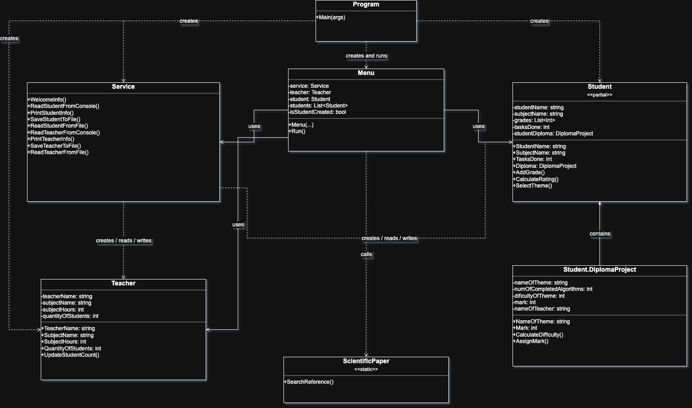

### 6.2. UML Use Case diagram

У звіті також використовується UML Use Case diagram як власний графічний варіант опису сценаріїв роботи програми. Вона показує функціональні можливості програми з точки зору користувача.

Назва системи на діаграмі: `Освітнє середовище`.

Актори діаграми:

- `Користувач(Студент)`;
- `Вчитель`.

Use cases діаграми:

- `Створити студента (ввести дані)`;
- `Додати оцінки студенту`;
- `Вивести данні студента`;
- `Зберегти дані студента у файл`;
- `Вибрати тему дипломного проєкту`;
- `Оновити навантаження викладача`;
- `Знайти наукову статтю за ID`.

Актор `Користувач(Студент)` взаємодіє з більшістю сценаріїв через консольне меню. Актор `Вчитель` пов’язаний зі сценаріями, які стосуються викладача та його навантаження.

Сценарій `Створити студента (ввести дані)` є базовим для частини інших дій зі студентом. Зв’язки `<<include>>` на діаграмі показують залежність окремих сценаріїв від попереднього створення або введення даних студента.

Ця діаграма використовується як допоміжне графічне пояснення сценаріїв роботи програми. Основною обов’язковою UML-діаграмою для звіту `LAB_3` є UML class diagram.

Файл джерела:

- `reports/lab3/Lab3_UseCaseDiagram.drawio`

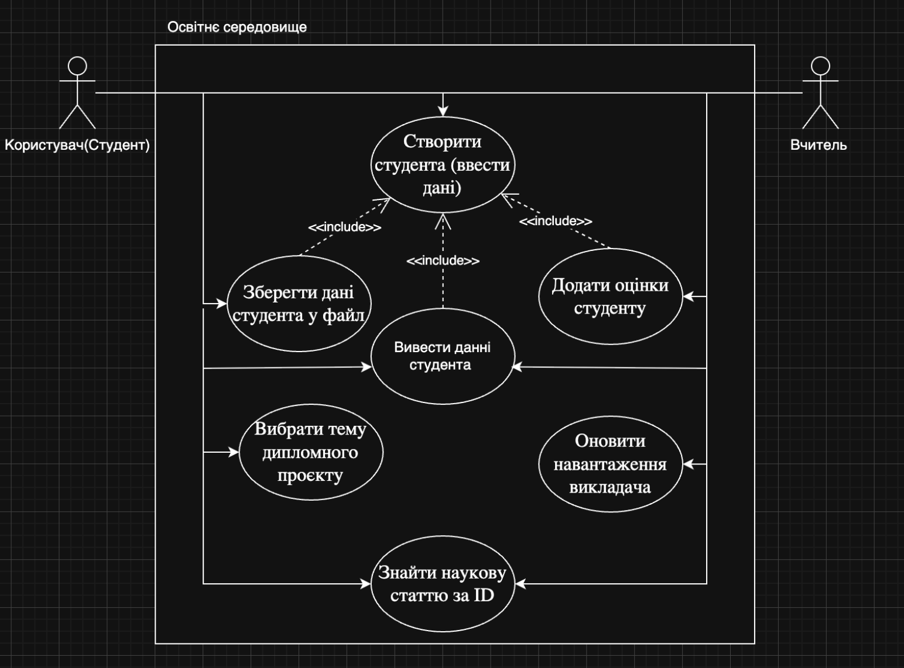

## 7. Структура програми

Основні файли версії `LAB_3_V4`:

- `Program.cs` — точка входу, створення основних об’єктів, запуск меню.
- `Menu.cs` — головний цикл програми та пункти меню.
- `Service.cs` — консольний ввід/вивід, друк даних, збереження і читання файлів.
- `Student.cs` — базова частина класу `Student` і базова частина вкладеного `DiplomaProject`.
- `Student_DiplomaProject.cs` — логіка складності та оцінювання дипломного проєкту.
- `Student_ThemeSelection.cs` — вибір теми дипломного проєкту з `themes.txt`.
- `Teacher.cs` — модель викладача і зміна навантаження.
- `ScientificPaper.cs` — статичний алгоритм бінарного пошуку.

Файли даних:

- `student_data.txt`;
- `teacher_data.txt`;
- `themes.txt`.

Повний текст коду доцільно подавати через Doxygen-генерацію. У цьому звіті наведено структуру і короткий технічний опис.

HTML-документація коду генерується за допомогою Doxygen і Graphviz на основі XML-коментарів у файлах `LAB_3_V4`.

Команда генерації:

```bash
doxygen reports/lab3/Doxyfile
```

## 8. Опис основних класів

### Student

`Student` — предметний клас для зберігання даних студента. Клас містить ім’я студента, назву предмета, список оцінок, кількість виконаних завдань та об’єкт `Diploma`. Основні методи: `AddGrade(int)`, `CalculateRating()`, `SelectTheme(string)`.

### Teacher

`Teacher` — предметний клас для зберігання даних викладача. Містить ім’я, предмет, кількість годин та кількість студентів. Основний метод `UpdateStudentCount(int)` змінює кількість студентів і відповідно коригує навчальні години.

### Student.DiplomaProject

`Student.DiplomaProject` — вкладений клас студента. Зберігає тему дипломного проєкту, кількість алгоритмів, складність, оцінку та поле для імені керівника. Основні методи: `CalculateDifficulty()` і `AssignMark()`.

### ScientificPaper

`ScientificPaper` — `static class`, який містить метод `SearchReference(int[] identifiers, int target)`. Клас не зберігає стан і використовується як окрема алгоритмічна операція пошуку.

### Service

`Service` — звичайний сервісний клас для допоміжної логіки. Він читає дані з консолі, друкує дані на екран, зберігає інформацію про студента і викладача у текстові файли та читає її назад.

### Menu

`Menu` — технічний клас керування сценарієм програми. Він відображає пункти меню, перевіряє допустимість дій та викликає методи `Service`, `Student`, `Teacher` і `ScientificPaper`.

### Program

`Program` — точка входу в застосунок. У `Main()` створюються `Service`, `Teacher`, `Student`, список студентів, після чого запускається `Menu.Run()`.

## 9. Реалізація основних ООП-механізмів

### Конструктори

У класах `Student` і `Teacher` реалізовані:

- конструктор за замовчуванням;
- конструктор з параметрами;
- конструктор копіювання.

У `Student.DiplomaProject` реалізований конструктор за замовчуванням.

### Властивості get/set

Інкапсуляція реалізована через приватні поля і публічні властивості:

- у `Student`: `StudentName`, `SubjectName`, `Grades`, `TasksDone`, `Diploma`;
- у `Teacher`: `TeacherName`, `SubjectName`, `SubjectHours`, `QuantityOfStudents`;
- у `Student.DiplomaProject`: `NameOfTheme`, `NumOfCompletedAlgorithms`, `NameOfTeacher`, `DificultyOfTheme`, `Mark`.

### Partial class

`Student` розбитий на кілька `partial`-файлів:

- `Student.cs`;
- `Student_DiplomaProject.cs`;
- `Student_ThemeSelection.cs`.

Це дозволяє розділити логіку студента на окремі частини без введення нових зовнішніх класів.

### Nested class

`Student.DiplomaProject` реалізований як вкладений клас у `Student`. Це показує, що дипломний проєкт у поточній моделі є частиною конкретного студента.

### Static class

`ScientificPaper` реалізований як `static class`, тому його метод пошуку викликається без створення об’єкта.

### Робота з файлами

У програмі використовується текстовий файловий ввід/вивід:

- `SaveStudentToFile()` і `ReadStudentFromFile()` працюють з `student_data.txt`;
- `SaveTeacherToFile()` і `ReadTeacherFromFile()` працюють з `teacher_data.txt`;
- `SelectTheme()` читає `themes.txt` і дозволяє вибрати тему за ключовим словом.

## 10. Результати виконання програми

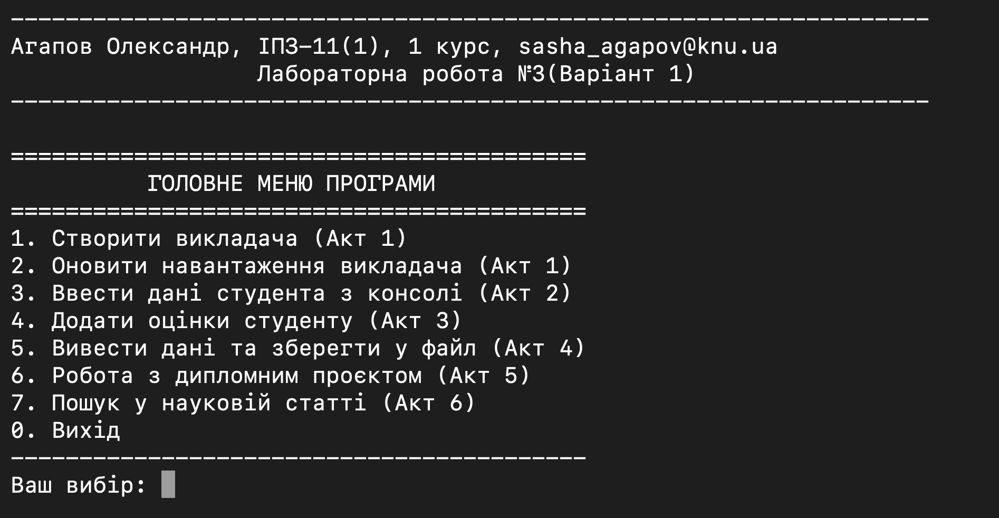
Показано стартовий екран програми з головним меню.

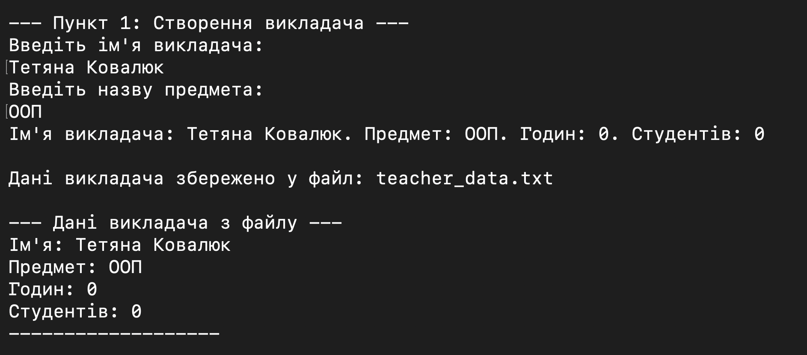
Показано створення викладача та первинне виведення його даних.

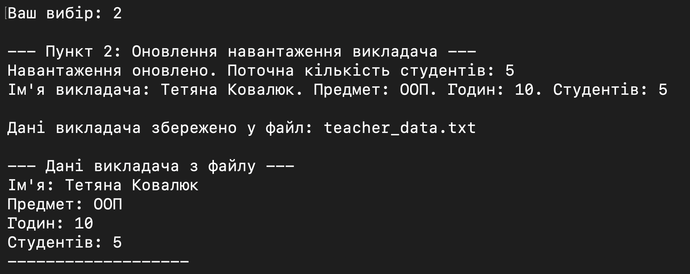
Показано оновлення навантаження викладача.

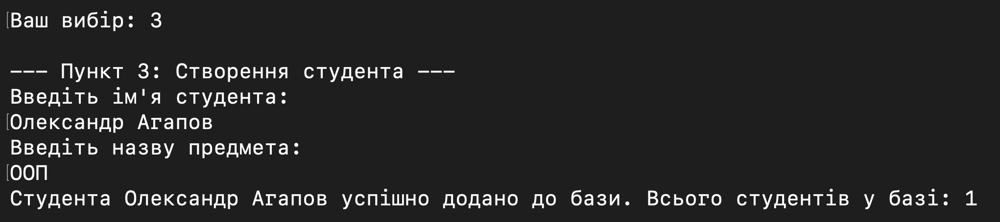
Показано введення та створення об’єкта студента.

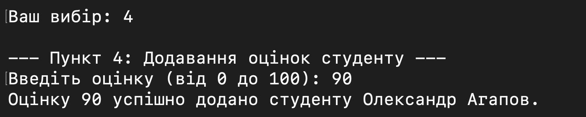
Показано додавання оцінки студенту через консоль.

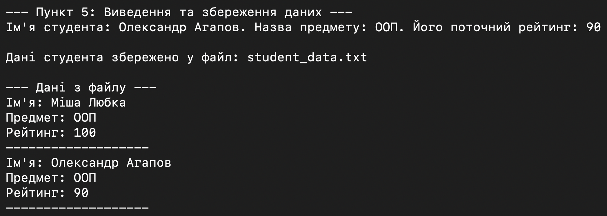
Показано виведення даних студента та запис у файл.

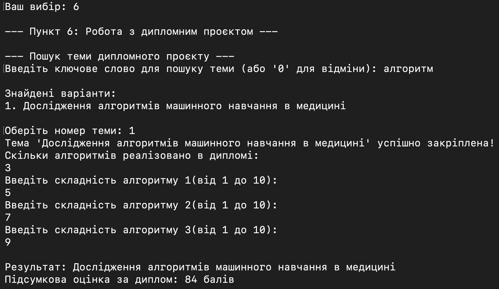
Показано результат роботи з дипломним проєктом і підсумкову оцінку.

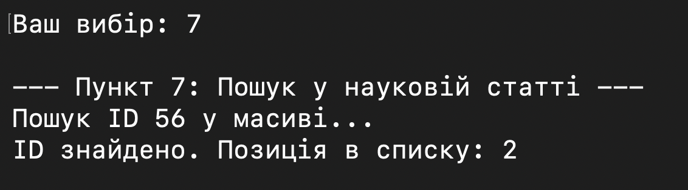
Показано пошук ID у масиві посилань наукової статті.

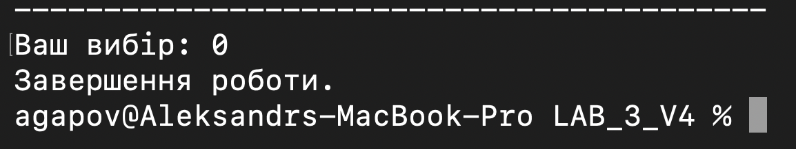
Показано коректне завершення роботи програми.

## 11. Аналіз достовірності результатів / контрольний приклад

### 11.1. Перевірка розрахунку рейтингу студента

Вхідні дані:

- оцінки: `90`, `80`, `100`;
- кількість виконаних завдань: `3`.

Ручний розрахунок:

`(90 + 80 + 100) / 3 = 270 / 3 = 90`

Очікуваний результат програми:

- метод `Student.CalculateRating()` повинен повернути `90`.

Висновок:

- результат програми збігається з ручною перевіркою.

### 11.2. Перевірка розрахунку оцінки дипломного проєкту

Вхідні дані:

- складності алгоритмів: `5`, `7`, `8`.

Ручний розрахунок:

- загальна складність: `5 + 7 + 8 = 20`;
- оцінка: `20 * 4 = 80`.

Очікуваний результат програми:

- загальна складність теми: `20`;
- підсумкова оцінка: `80`.

Висновок:

- результат програми збігається з ручною перевіркою.

### 11.3. Перевірка бінарного пошуку ID у ScientificPaper.SearchReference()

Вхідні дані:

- масив ID: `[12, 34, 56, 78, 90]`;
- шуканий ID: `56`.

Ручний розрахунок:

- індекс елемента `56` у відсортованому масиві дорівнює `2`.

Очікуваний результат програми:

- метод `ScientificPaper.SearchReference()` повинен повернути `2`.

Висновок:

- результат програми збігається з ручною перевіркою.

## 12. Висновок

У лабораторній роботі №3 реалізовано консольну програму для моделювання навчального процесу. Під час виконання роботи проведено OOA та OOD, підготовлено UML class diagram і UML Use Case diagram, додано скріншоти виконання програми. Також виконано контрольну перевірку розрахунку рейтингу студента, оцінки дипломного проєкту та бінарного пошуку. Код версії `LAB_3_V4` підготовлено до генерації документації через Doxygen.
