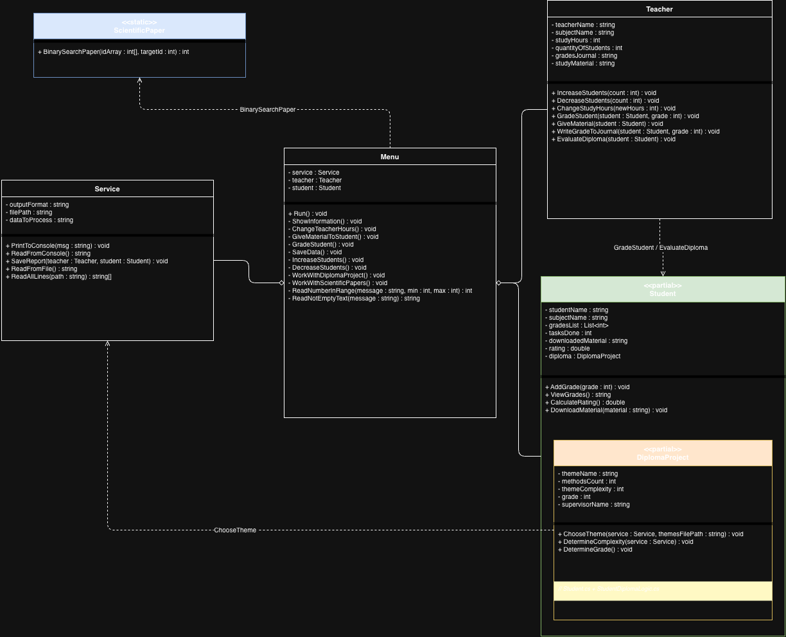
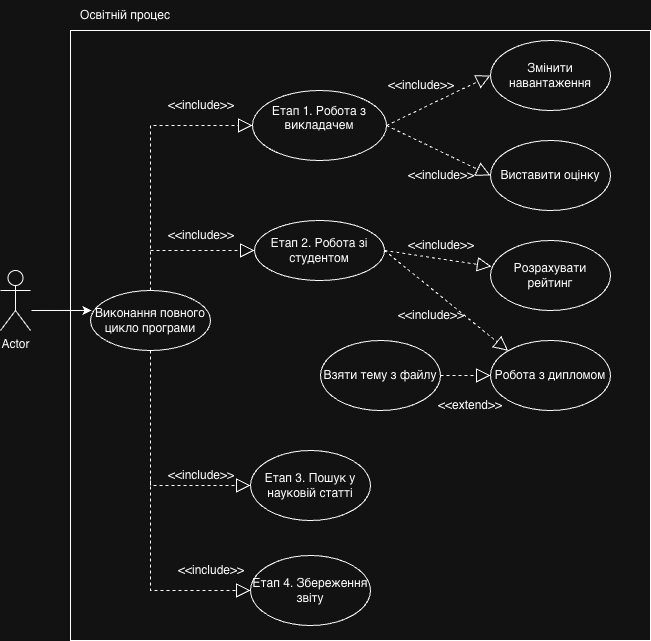

# Лабораторна робота №3

## 1. Титульна інформація

Київський національний університет імені Тараса Шевченка  
Факультет інформаційних технологій  
Кафедра програмних систем і технологій  
Дисципліна: Вступ до об'єктно-орієнтованого програмування  
Лабораторна робота №3  
Виконав: Агапов Олександр, ІПЗ-11(1), 1 курс  
Рік: 2026

## 2. Мета роботи

Метою лабораторної роботи є розроблення консольної програми мовою C# з використанням базових принципів об'єктно-орієнтованого програмування, виконання об'єктно-орієнтованого аналізу та проєктування, побудова UML-діаграм і документування фінальної архітектури версії `LAB_3/LAB_3_V4`.

У роботі необхідно показати практичне використання класів, об'єктів, конструкторів, властивостей, інкапсуляції, композиції, вкладених класів, partial-класів, статичного класу та файлового введення/виведення.

## 3. Умова задачі

Потрібно розробити консольну програму для моделювання спрощеного освітнього процесу. Програма повинна підтримувати роботу з викладачем, студентом, оцінками, навчальним матеріалом, дипломним проєктом і науковими статтями.

Функціональні можливості програми:

- перегляд інформації про викладача, студента та дипломний проєкт;
- зміна навчального навантаження викладача;
- передавання навчального матеріалу від викладача студенту;
- виставлення оцінки студенту;
- обчислення рейтингу студента;
- збільшення та зменшення кількості студентів у викладача;
- вибір теми дипломного проєкту з файлу `themes.txt`;
- визначення складності дипломного проєкту;
- оцінювання дипломного проєкту викладачем;
- збереження підсумкового звіту у файл `student_report.txt`;
- виконання бінарного пошуку ідентифікатора наукової статті.

## 4. Аналіз задачі / OOA

Предметна область лабораторної роботи описує взаємодію студента і викладача в межах навчального процесу. У фінальній версії `LAB_3_V4` система не моделює повну інформаційну систему університету, а зосереджується на невеликому наборі сутностей, потрібних для демонстрації ООП.

Основні сутності предметної області:

- `Teacher` - викладач, який має ім'я, дисципліну, навчальне навантаження, кількість студентів, журнал оцінок і навчальний матеріал.
- `Student` - студент, який має ім'я, дисципліну, список оцінок, кількість виконаних робіт, отриманий матеріал, рейтинг і дипломний проєкт.
- `DiplomaProject` - дипломний проєкт студента, який містить тему, кількість методів, сумарну складність, оцінку та ім'я керівника.
- `ScientificPaper` - статичний клас для демонстрації алгоритмічної операції бінарного пошуку наукової статті за ID.
- `Service` - службовий клас, який забезпечує введення, виведення та роботу з текстовими файлами.
- `Menu` - клас, який керує сценаріями роботи користувача через консольне меню.
- `Program` - точка входу в програму.

Основні сценарії предметної області:

- користувач переглядає поточні дані викладача та студента;
- викладач змінює кількість навчальних годин;
- викладач передає студенту навчальний матеріал через властивість `StudyMaterial`;
- викладач виставляє студенту оцінку, після чого запис додається до `GradesJournal`;
- студент отримує оцінки, а кількість виконаних робіт зберігається у `TasksDone`;
- студент має власний дипломний проєкт;
- тема дипломного проєкту вибирається з файлу `themes.txt`;
- складність дипломного проєкту записується у `ThemeComplexity`;
- викладач оцінює дипломний проєкт методом `EvaluateDiploma(Student)`;
- результат роботи зберігається у файл `student_report.txt`;
- пошук наукової статті виконується методом `BinarySearchPaper`.

Важливо, що у фінальній архітектурі `Teacher` не є полем класу `Student`, а `Student` не є полем класу `Teacher`. Їхня взаємодія відбувається через методи, які приймають об'єкт іншого класу як параметр. Наприклад, `Teacher.EvaluateDiploma(Student)` отримує студента, звертається до його `Diploma` і запускає визначення оцінки дипломного проєкту.

## 5. Об'єктно-орієнтоване проєктування / OOD

На етапі об'єктно-орієнтованого проєктування сутності предметної області були перенесені у класи C#.

Відповідність між сутностями та класами:

- студент - `Student`;
- викладач - `Teacher`;
- дипломний проєкт - `Student.DiplomaProject`;
- наукова стаття / пошук статті - `ScientificPaper`;
- службові операції введення, виведення та файлів - `Service`;
- консольний сценарій - `Menu`;
- запуск програми - `Program`.

Ключові проєктні рішення:

- `Student` реалізовано як `partial class`;
- `Student` розділено рівно на два файли: `Student.cs` і `StudentDiplomaLogic.cs`;
- `DiplomaProject` реалізовано як вкладений partial-клас усередині `Student`;
- зв'язок `Student` і `DiplomaProject` є композицією, оскільки дипломний проєкт належить конкретному студенту;
- `Teacher` відповідає не лише за власні дані, а й за дії викладача щодо студента;
- оцінювання диплома виконується методом `EvaluateDiploma(Student)`;
- `ScientificPaper` реалізовано як `static class`;
- пошук у `ScientificPaper` виконується методом `BinarySearchPaper`;
- `Service` реалізовано як звичайний клас, що обслуговує консоль і файлові операції;
- `Service.SaveReport(Teacher, Student)` формує і зберігає підсумковий звіт;
- `Service.ReadAllLines(string path)` читає рядки з текстового файлу, зокрема з `themes.txt`;
- успадкування у цій версії лабораторної роботи не використовується як основний механізм моделі.

Основні зв'язки між класами:

- `Program` створює об'єкти `Service`, `Teacher`, `Student.DiplomaProject`, `Student` і `Menu`;
- `Menu` використовує `Service`, `Teacher`, `Student` і `ScientificPaper`;
- `Teacher` залежить від `Student` у методах `GradeStudent(Student, int)`, `GiveMaterial(Student)` і `EvaluateDiploma(Student)`;
- `Student` композиційно містить `DiplomaProject`;
- `Service` використовує `Teacher` і `Student` під час формування звіту;
- `Student.DiplomaProject` використовує `Service` під час вибору теми та введення складності.

У класах `Teacher`, `Student`, `Service` і `Student.DiplomaProject` реалізовано рівно три конструктори: конструктор за замовчуванням, конструктор з параметрами та конструктор копіювання.

## 6. Графічне зображення структури програми

### 6.1. UML class diagram

Для фінальної версії `LAB_3_V4` побудовано UML class diagram, яка відображає реальну структуру класів програми.

Класи на діаграмі:

- `Program`;
- `Menu`;
- `Service`;
- `Teacher`;
- `Student`;
- `Student.DiplomaProject`;
- `ScientificPaper`.

Основні зв'язки на діаграмі:

- `Program ..> Menu` - створення та запуск меню;
- `Program ..> Service` - створення службового об'єкта;
- `Program ..> Teacher` - створення початкового об'єкта викладача;
- `Program ..> Student` - створення початкового об'єкта студента;
- `Menu --> Service` - використання сервісу для введення, виведення та збереження;
- `Menu --> Teacher` - використання методів викладача;
- `Menu --> Student` - використання даних і методів студента;
- `Menu ..> ScientificPaper` - виклик статичного методу пошуку;
- `Service ..> Teacher` - формування звіту з даними викладача;
- `Service ..> Student` - формування звіту з даними студента;
- `Teacher ..> Student` - залежність викладача від студента під час виставлення оцінки, передавання матеріалу та оцінювання диплома;
- `Student *-- DiplomaProject` - композиція: дипломний проєкт є складовою частиною студента.

Зв'язок `Student *-- DiplomaProject` означає, що об'єкт дипломного проєкту розглядається як частина об'єкта студента. Зв'язок `Teacher ..> Student` показує, що викладач залежить від студента у поведінкових методах, зокрема в `EvaluateDiploma(Student)`.



### 6.2. UML Use Case diagram

UML Use Case diagram описує сценарії використання програми з погляду людини, яка працює з консольним меню.

У системі є рівно один фізичний актор - `User`. Саме користувач взаємодіє з програмою через консоль. При цьому окремі дії користувач виконує під логічними ролями студента і викладача. Наприклад, введення оцінки або оцінювання диплома належить до логіки ролі викладача, а перегляд даних студента або робота з дипломною темою належить до логіки ролі студента. Однак фізично з програмою взаємодіє одна особа - `User`.

Основні use cases:

- переглянути інформацію про викладача та студента;
- змінити кількість годин навчального навантаження;
- передати навчальний матеріал студенту;
- поставити оцінку студенту;
- зберегти результати у файл;
- збільшити кількість студентів;
- зменшити кількість студентів;
- працювати з дипломним проєктом;
- виконати бінарний пошук наукової статті;
- завершити роботу програми.

Сценарій роботи з дипломним проєктом включає вибір теми, визначення складності та оцінювання диплома викладачем. Оцінювання диплома пов'язане з методом `Teacher.EvaluateDiploma(Student)`.



## 7. Структура програми

Фінальна версія `LAB_3_V4` містить такі C# файли:

- `Program.cs` - точка входу в програму. Створює початкові об'єкти `Service`, `Teacher`, `Student.DiplomaProject`, `Student` і запускає `Menu.Run()`.
- `Menu.cs` - керує головним циклом консольного меню та викликає методи інших класів.
- `Service.cs` - відповідає за введення, виведення, збереження звіту та читання рядків з файлів.
- `Teacher.cs` - описує викладача, його властивості та дії щодо студента.
- `Student.cs` - містить основну частину класу `Student`, вкладений клас `DiplomaProject`, їхні поля, властивості, конструктори та базові методи.
- `StudentDiplomaLogic.cs` - містить логіку роботи з дипломним проєктом: вибір теми, визначення складності та визначення оцінки.
- `ScientificPaper.cs` - містить статичний метод `BinarySearchPaper` для бінарного пошуку ID наукової статті.

Файли даних у фінальній версії:

- `student_report.txt` - файл для збереження підсумкового звіту про викладача, студента та дипломний проєкт;
- `themes.txt` - файл зі списком тем дипломних проєктів.

Інших текстових файлів даних у фінальній архітектурі `LAB_3_V4` не використовується. Збереження виконується в один підсумковий звіт через `Service.SaveReport(Teacher, Student)`.

## 8. Опис основних класів

### Student

`Student` - предметний клас, який описує студента в освітньому процесі. Клас реалізовано як `partial class` і розділено рівно на два файли: `Student.cs` та `StudentDiplomaLogic.cs`.

Основні властивості класу `Student`:

- `StudentName` - ім'я студента;
- `SubjectName` - назва дисципліни;
- `GradesList` - список оцінок студента;
- `TasksDone` - кількість виконаних робіт;
- `DownloadedMaterial` - навчальний матеріал, отриманий від викладача;
- `Rating` - поточний рейтинг студента;
- `Diploma` - дипломний проєкт студента.

Основні методи класу `Student`:

- `AddGrade(int grade)` - додає оцінку до `GradesList` і збільшує `TasksDone`;
- `ViewGrades()` - повертає оцінки студента у текстовому вигляді;
- `CalculateRating()` - обчислює середнє арифметичне оцінок;
- `DownloadMaterial(string material)` - записує отриманий навчальний матеріал у `DownloadedMaterial`.

Клас `Student` має рівно три конструктори: конструктор за замовчуванням, конструктор з параметрами та конструктор копіювання.

### Teacher

`Teacher` - предметний клас, який описує викладача та його дії в освітньому процесі.

Основні властивості класу `Teacher`:

- `TeacherName` - ім'я викладача;
- `SubjectName` - назва дисципліни;
- `StudyHours` - кількість навчальних годин;
- `QuantityOfStudents` - кількість студентів;
- `GradesJournal` - текстовий журнал оцінок і дій викладача;
- `StudyMaterial` - навчальний матеріал викладача.

Основні методи класу `Teacher`:

- `IncreaseStudents(int count)` - збільшує кількість студентів;
- `DecreaseStudents(int count)` - зменшує кількість студентів, якщо це можливо;
- `ChangeStudyHours(int newHours)` - змінює навчальне навантаження;
- `GradeStudent(Student student, int grade)` - додає оцінку студенту;
- `GiveMaterial(Student student)` - передає студенту навчальний матеріал;
- `WriteGradeToJournal(Student student, int grade)` - записує інформацію про оцінку до `GradesJournal`;
- `EvaluateDiploma(Student student)` - оцінює дипломний проєкт студента.

Метод `EvaluateDiploma(Student)` є важливим для фінальної архітектури. Саме викладач запускає оцінювання диплома: метод викликає `student.Diploma.DetermineGrade()` і записує результат у `GradesJournal`.

Клас `Teacher` має рівно три конструктори: конструктор за замовчуванням, конструктор з параметрами та конструктор копіювання.

### Student.DiplomaProject

`Student.DiplomaProject` - вкладений клас, який описує дипломний проєкт конкретного студента. Він реалізований як частина `Student`, тому між `Student` і `DiplomaProject` використовується композиція.

Основні властивості класу `DiplomaProject`:

- `ThemeName` - назва теми дипломного проєкту;
- `MethodsCount` - кількість реалізованих методів;
- `ThemeComplexity` - сумарна складність теми;
- `Grade` - оцінка за дипломний проєкт;
- `SupervisorName` - ім'я керівника дипломного проєкту.

Основні методи класу `DiplomaProject`:

- `ChooseTheme(Service service, string themesFilePath)` - вибирає тему з файлу `themes.txt` за ключовим словом;
- `DetermineComplexity(Service service)` - вводить складність кожного методу та обчислює `ThemeComplexity`;
- `DetermineGrade()` - визначає оцінку за дипломний проєкт на основі `ThemeComplexity`.

Клас `DiplomaProject` має рівно три конструктори: конструктор за замовчуванням, конструктор з параметрами та конструктор копіювання.

### ScientificPaper

`ScientificPaper` - статичний клас, який демонструє роботу алгоритмічного методу без створення об'єкта класу.

Основний метод:

- `BinarySearchPaper(int[] idArray, int targetId)` - виконує ітеративний бінарний пошук ID наукової статті у відсортованому масиві.

Метод повертає індекс знайденого елемента або `-1`, якщо ID у масиві немає.

### Service

`Service` - службовий клас для введення, виведення та файлових операцій.

Основні властивості класу `Service`:

- `OutputFormat` - формат виведення;
- `FilePath` - шлях до основного файлу звіту;
- `DataToProcess` - текстові дані, підготовлені до обробки або запису.

Основні методи класу `Service`:

- `PrintToConsole(string msg)` - виводить повідомлення в консоль;
- `ReadFromConsole()` - читає рядок з консолі;
- `SaveReport(Teacher teacher, Student student)` - формує звіт про викладача, студента і дипломний проєкт та записує його у файл;
- `ReadFromFile()` - читає вміст основного файлу звіту;
- `ReadAllLines(string path)` - читає всі рядки з указаного текстового файлу.

У фінальній версії саме `SaveReport(Teacher, Student)` відповідає за збереження результатів у `student_report.txt`, а `ReadAllLines` використовується для читання тем з `themes.txt`.

Клас `Service` має рівно три конструктори: конструктор за замовчуванням, конструктор з параметрами та конструктор копіювання.

### Menu

`Menu` - технічний клас, який керує взаємодією користувача з програмою. Він містить головний цикл меню, читає вибір користувача і викликає відповідні методи `Service`, `Teacher`, `Student` та `ScientificPaper`.

Основні сценарії, реалізовані в `Menu`:

- `ShowInformation()` - показує інформацію про викладача, студента та дипломний проєкт;
- `ChangeTeacherHours()` - змінює кількість навчальних годин;
- `GiveMaterialToStudent()` - передає навчальний матеріал студенту;
- `GradeStudent()` - виставляє оцінку студенту;
- `SaveData()` - зберігає звіт;
- `IncreaseStudents()` - збільшує кількість студентів;
- `DecreaseStudents()` - зменшує кількість студентів;
- `WorkWithDiplomaProject()` - виконує вибір теми, розрахунок складності та оцінювання диплома;
- `WorkWithScientificPapers()` - виконує бінарний пошук ID статті.

### Program

`Program` - клас із методом `Main`, який є точкою входу в застосунок.

У `Main()` виконуються такі дії:

- очищення консолі;
- створення `Service` з файлом `student_report.txt`;
- створення початкового об'єкта `Teacher`;
- створення початкового об'єкта `Student.DiplomaProject`;
- створення початкового об'єкта `Student`;
- створення `Menu`;
- запуск `menu.Run()`.

## 9. Реалізація основних ООП-механізмів

### Конструктори

У фінальній версії `LAB_3_V4` класи `Teacher`, `Student`, `Service` і `Student.DiplomaProject` мають рівно три конструктори:

- конструктор за замовчуванням;
- конструктор з параметрами;
- конструктор копіювання.

Конструктор за замовчуванням створює об'єкт із початковими порожніми або нульовими значеннями. Конструктор з параметрами дозволяє одразу задати повний стан об'єкта. Конструктор копіювання створює новий об'єкт на основі вже існуючого.

### Інкапсуляція та властивості

Інкапсуляція реалізована через приватні поля та публічні властивості.

У `Teacher` використовуються властивості:

- `TeacherName`;
- `SubjectName`;
- `StudyHours`;
- `QuantityOfStudents`;
- `GradesJournal`;
- `StudyMaterial`.

У `Student` використовуються властивості:

- `StudentName`;
- `SubjectName`;
- `GradesList`;
- `TasksDone`;
- `DownloadedMaterial`;
- `Rating`;
- `Diploma`.

У `Student.DiplomaProject` використовуються властивості:

- `ThemeName`;
- `MethodsCount`;
- `ThemeComplexity`;
- `Grade`;
- `SupervisorName`.

У `Service` використовуються властивості:

- `OutputFormat`;
- `FilePath`;
- `DataToProcess`.

### Partial class

Клас `Student` реалізований як partial-клас і розділений рівно між двома файлами:

- `Student.cs`;
- `StudentDiplomaLogic.cs`.

Файл `Student.cs` містить основні поля, властивості, конструктори та методи студента, а також оголошення вкладеного класу `DiplomaProject`. Файл `StudentDiplomaLogic.cs` містить логіку, пов'язану з дипломним проєктом: `ChooseTheme`, `DetermineComplexity` і `DetermineGrade`.

### Nested class

`DiplomaProject` реалізовано як вкладений клас усередині `Student`. Це відповідає змісту предметної області: дипломний проєкт у цій моделі належить конкретному студенту.

### Композиція

Композиція показана зв'язком `Student *-- DiplomaProject`. Об'єкт `Student` містить властивість `Diploma`, яка посилається на об'єкт `DiplomaProject`. У конструкторі за замовчуванням студента створюється новий дипломний проєкт, а в конструкторі копіювання дипломний проєкт копіюється в окремий новий об'єкт.

### Static class

`ScientificPaper` реалізовано як статичний клас. Це означає, що для використання методу бінарного пошуку не потрібно створювати екземпляр класу.

Метод `ScientificPaper.BinarySearchPaper(int[] idArray, int targetId)` викликається безпосередньо через ім'я класу.

### Робота з файлами

Файлова логіка зосереджена у класі `Service`.

Метод `SaveReport(Teacher, Student)` формує текстовий звіт, у який входять:

- дані викладача;
- значення `StudyMaterial`;
- вміст `GradesJournal`;
- дані студента;
- оцінки зі `GradesList`;
- кількість виконаних робіт `TasksDone`;
- рейтинг студента;
- дані дипломного проєкту, зокрема `ThemeName`, `ThemeComplexity` і `Grade`.

Метод `ReadAllLines(string path)` читає всі рядки з текстового файлу. У програмі він використовується для отримання списку тем дипломних проєктів із `themes.txt`.

## 10. Результати виконання програми

### 10.1. Запуск програми та головне меню

Після запуску `Program.Main()` створюються початкові об'єкти `Service`, `Teacher`, `Student.DiplomaProject`, `Student` і `Menu`. Далі керування переходить до методу `Menu.Run()`, який показує користувачу головне меню з пунктами `0-9`.

```text
Лабораторна робота 3, версія 4. Початкові об'єкти створені.

--- Меню освітнього процесу ---
1. Показати інформацію про викладача та студента
2. Викладач: змінити кількість годин навантаження
3. Викладач: передати навчальний матеріал студенту
4. Викладач: поставити оцінку студенту
5. Зберегти результати у файл
6. Викладач: збільшити кількість студентів
7. Викладач: зменшити кількість студентів
8. Робота з дипломним проєктом
9. Робота з науковими статтями (Бінарний пошук)
0. Вийти
Оберіть пункт:
```

### 10.2. Перегляд початкової інформації про викладача та студента

Для перегляду поточного стану об'єктів користувач обирає пункт `1`. У цьому сценарії програма виводить дані викладача Ковалюк Т.В., студента Агапова Олександра, поточний список оцінок, рейтинг і стан дипломного проєкту.

```text
Оберіть пункт:
1

Викладач: Ковалюк Т.В.
Дисципліна викладача: ООП
Навчальне навантаження: 120
Кількість студентів: 1
Навчальний матеріал викладача: Матеріали до лабораторної роботи 3
Журнал оцінок:

Студент: Агапов Олександр
Дисципліна студента: ООП
Оцінки студента: Оцінок немає
Обсяг виконаних робіт: 0
Рейтинг студента: 0
Отриманий матеріал:
Тема дипломного проєкту:
Оцінка за дипломний проєкт: 0
```

### 10.3. Зміна навчального навантаження викладача

Пункт `2` викликає метод `ChangeTeacherHours()`. Користувач вводить нову кількість годин, після чого об'єкт `Teacher` оновлюється через метод `ChangeStudyHours(int)`.

```text
--- Меню освітнього процесу ---
1. Показати інформацію про викладача та студента
2. Викладач: змінити кількість годин навантаження
3. Викладач: передати навчальний матеріал студенту
4. Викладач: поставити оцінку студенту
5. Зберегти результати у файл
6. Викладач: збільшити кількість студентів
7. Викладач: зменшити кількість студентів
8. Робота з дипломним проєктом
9. Робота з науковими статтями (Бінарний пошук)
0. Вийти
Оберіть пункт:
2
Введіть нову кількість годин навчального навантаження (0-300):
135
Години успішно змінено
```

### 10.4. Передавання навчального матеріалу студенту

Пункт `3` демонструє взаємодію викладача і студента. Спочатку значення записується у властивість `StudyMaterial`, а потім викладач передає матеріал студенту через `GiveMaterial(Student)`.

```text
--- Меню освітнього процесу ---
1. Показати інформацію про викладача та студента
2. Викладач: змінити кількість годин навантаження
3. Викладач: передати навчальний матеріал студенту
4. Викладач: поставити оцінку студенту
5. Зберегти результати у файл
6. Викладач: збільшити кількість студентів
7. Викладач: зменшити кількість студентів
8. Робота з дипломним проєктом
9. Робота з науковими статтями (Бінарний пошук)
0. Вийти
Оберіть пункт:
3
Введіть назву матеріалу:
Лекція 3: класи, об'єкти та композиція
Матеріал передано студенту
```

### 10.5. Виставлення оцінки студенту

Пункт `4` викликає метод `GradeStudent()` у класі `Menu`. Далі викладач ставить оцінку через `Teacher.GradeStudent(Student, int)`, а запис про оцінювання додається до `GradesJournal`.

```text
--- Меню освітнього процесу ---
1. Показати інформацію про викладача та студента
2. Викладач: змінити кількість годин навантаження
3. Викладач: передати навчальний матеріал студенту
4. Викладач: поставити оцінку студенту
5. Зберегти результати у файл
6. Викладач: збільшити кількість студентів
7. Викладач: зменшити кількість студентів
8. Робота з дипломним проєктом
9. Робота з науковими статтями (Бінарний пошук)
0. Вийти
Оберіть пункт:
4
Введіть оцінку студента (0-100):
92
Оцінку виставлено і записано в журнал
```

### 10.6. Робота з дипломним проєктом та оцінювання через EvaluateDiploma

Пункт `8` запускає повний сценарій роботи з дипломним проєктом: пошук теми у файлі `themes.txt`, введення кількості методів, введення складності кожного методу, обчислення `ThemeComplexity` і оцінювання диплома викладачем через `EvaluateDiploma(Student)`. У прикладі сума складностей дорівнює `55`, тому метод `DetermineGrade()` встановлює оцінку `100`.

```text
--- Меню освітнього процесу ---
1. Показати інформацію про викладача та студента
2. Викладач: змінити кількість годин навантаження
3. Викладач: передати навчальний матеріал студенту
4. Викладач: поставити оцінку студенту
5. Зберегти результати у файл
6. Викладач: збільшити кількість студентів
7. Викладач: зменшити кількість студентів
8. Робота з дипломним проєктом
9. Робота з науковими статтями (Бінарний пошук)
0. Вийти
Оберіть пункт:
8
--- Робота з дипломним проєктом ---
Введіть непорожнє ключове слово для пошуку теми дипломного проєкту:
Telegram
Обрана тема: Розробка Telegram-бота для автоматизації бізнес-процесів
Введіть кількість реалізованих методів (1-20):
6
Введіть складність методу номер 1 (1-10):
10
Введіть складність методу номер 2 (1-10):
9
Введіть складність методу номер 3 (1-10):
8
Введіть складність методу номер 4 (1-10):
10
Введіть складність методу номер 5 (1-10):
9
Введіть складність методу номер 6 (1-10):
9
Загальна складність теми: 55
Тема дипломного проєкту: Розробка Telegram-бота для автоматизації бізнес-процесів
Складність теми: 55
Оцінка за дипломний проєкт: 100
```

### 10.7. Перевірка оновленого стану після оцінювання

Після виконання пунктів `3`, `4` і `8` повторний вибір пункту `1` показує оновлений стан об'єктів. У журналі `GradesJournal` видно і звичайну оцінку студента, і результат оцінювання дипломного проєкту.

```text
Оберіть пункт:
1

Викладач: Ковалюк Т.В.
Дисципліна викладача: ООП
Навчальне навантаження: 135
Кількість студентів: 1
Навчальний матеріал викладача: Лекція 3: класи, об'єкти та композиція
Журнал оцінок:
Студент Агапов Олександр отримав оцінку 92 з дисципліни ООП.
Викладач оцінив дипломний проєкт студента Агапов Олександр. Оцінка: 100.

Студент: Агапов Олександр
Дисципліна студента: ООП
Оцінки студента: 92
Обсяг виконаних робіт: 1
Рейтинг студента: 92
Отриманий матеріал: Лекція 3: класи, об'єкти та композиція
Тема дипломного проєкту: Розробка Telegram-бота для автоматизації бізнес-процесів
Оцінка за дипломний проєкт: 100
```

### 10.8. Бінарний пошук наукової статті через BinarySearchPaper

Пункт `9` демонструє роботу статичного методу `ScientificPaper.BinarySearchPaper`. Пошук виконується у відсортованому масиві ID `[101, 205, 308, 412, 550]`. Для введеного ID `308` метод повертає індекс `2`.

```text
--- Меню освітнього процесу ---
1. Показати інформацію про викладача та студента
2. Викладач: змінити кількість годин навантаження
3. Викладач: передати навчальний матеріал студенту
4. Викладач: поставити оцінку студенту
5. Зберегти результати у файл
6. Викладач: збільшити кількість студентів
7. Викладач: зменшити кількість студентів
8. Робота з дипломним проєктом
9. Робота з науковими статтями (Бінарний пошук)
0. Вийти
Оберіть пункт:
9
--- Робота з науковими статтями ---
Доступні ID статей: 101, 205, 308, 412, 550
Введіть ID статті для пошуку (1-1000):
308
Статтю знайдено. Індекс у масиві: 2
```

### 10.9. Збереження звіту у student_report.txt та завершення програми

Пункт `5` викликає `Service.SaveReport(Teacher, Student)` і записує підсумкові дані у файл `student_report.txt`. Нижче наведено фрагмент вмісту файлу після збереження. Після цього користувач завершує роботу програми пунктом `0`.

```text
--- Меню освітнього процесу ---
1. Показати інформацію про викладача та студента
2. Викладач: змінити кількість годин навантаження
3. Викладач: передати навчальний матеріал студенту
4. Викладач: поставити оцінку студенту
5. Зберегти результати у файл
6. Викладач: збільшити кількість студентів
7. Викладач: зменшити кількість студентів
8. Робота з дипломним проєктом
9. Робота з науковими статтями (Бінарний пошук)
0. Вийти
Оберіть пункт:
5
Дані збережено у файл
```

Фрагмент згенерованого файлу `student_report.txt`:

```text
--- ЗВІТ ПРО ОСВІТНІЙ ПРОЦЕС ---
Викладач: Ковалюк Т.В.
Дисципліна: ООП
Навантаження: 135 год.
Кількість студентів: 1
Матеріал викладача: Лекція 3: класи, об'єкти та композиція
Журнал оцінок:
Студент Агапов Олександр отримав оцінку 92 з дисципліни ООП.
Викладач оцінив дипломний проєкт студента Агапов Олександр. Оцінка: 100.

Студент: Агапов Олександр
Дисципліна студента: ООП
Оцінки: 92
Виконано робіт: 1
Рейтинг: 92
Матеріал студента: Лекція 3: класи, об'єкти та композиція
Тема дипломного проєкту: Розробка Telegram-бота для автоматизації бізнес-процесів
Кількість методів: 6
Складність теми: 55
Оцінка за диплом: 100
Керівник: Ковалюк Т.В.
```

```text
--- Меню освітнього процесу ---
1. Показати інформацію про викладача та студента
2. Викладач: змінити кількість годин навантаження
3. Викладач: передати навчальний матеріал студенту
4. Викладач: поставити оцінку студенту
5. Зберегти результати у файл
6. Викладач: збільшити кількість студентів
7. Викладач: зменшити кількість студентів
8. Робота з дипломним проєктом
9. Робота з науковими статтями (Бінарний пошук)
0. Вийти
Оберіть пункт:
0
Програму завершено
```

## 11. Аналіз достовірності результатів / контрольний приклад

### 11.1. Перевірка розрахунку рейтингу студента

Вхідні дані:

- оцінки студента: `90`, `80`, `100`;
- кількість оцінок: `3`.

Ручний розрахунок:

`(90 + 80 + 100) / 3 = 270 / 3 = 90`

Логіка програми:

- оцінки зберігаються у `GradesList`;
- метод `CalculateRating()` підсумовує всі оцінки;
- результат ділиться на кількість оцінок;
- обчислене значення записується у `Rating`.

Очікуваний результат:

- `Student.CalculateRating()` повертає `90`.

Висновок:

- результат програми збігається з ручним розрахунком.

### 11.2. Перевірка розрахунку оцінки дипломного проєкту

Вхідні дані:

- кількість методів: `3`;
- складності методів: `6`, `7`, `8`.

Ручний розрахунок сумарної складності:

`6 + 7 + 8 = 21`

Отже:

- `ThemeComplexity = 21`.

Логіка оцінювання в коді:

```csharp
if (themeComplexity > 50)
{
    grade = 100;
}
else
{
    grade = 75;
}
```

Перевірка умови:

`21 > 50` - хибно.

Тому програма повинна встановити:

- `Grade = 75`.

Очікуваний результат:

- загальна складність теми: `21`;
- підсумкова оцінка дипломного проєкту: `75`.

Висновок:

- результат відповідає реальній логіці методу `DetermineGrade()`;
- оцінка не обчислюється множенням складності на коефіцієнт, а визначається умовою `themeComplexity > 50`.

### 11.3. Перевірка бінарного пошуку ID у ScientificPaper.BinarySearchPaper()

Вхідні дані:

- масив ID: `[101, 205, 308, 412, 550]`;
- шуканий ID: `308`.

Ручна перевірка:

- масив відсортований за зростанням;
- елемент `308` розташований на індексі `2`, якщо нумерація індексів починається з нуля.

Очікуваний результат:

- `ScientificPaper.BinarySearchPaper(idArray, 308)` повертає `2`.

Якщо шуканого ID немає в масиві, метод повинен повернути `-1`.

Висновок:

- метод `BinarySearchPaper` коректно реалізує ітеративний бінарний пошук у відсортованому масиві.

## 12. Висновок

У лабораторній роботі №3 реалізовано консольну програму мовою C# для моделювання спрощеного освітнього процесу. Фінальна версія `LAB_3_V4` містить класи `Program`, `Menu`, `Service`, `Teacher`, `Student`, `Student.DiplomaProject` і `ScientificPaper`.

У роботі використано основні механізми ООП: інкапсуляцію, конструктори, властивості, композицію, вкладений клас, partial-клас і статичний клас. Класи `Teacher`, `Student`, `Service` і `Student.DiplomaProject` мають рівно три конструктори: за замовчуванням, з параметрами та копіювання.

Особливістю фінальної архітектури є те, що `Teacher` виконує оцінювання дипломного проєкту методом `EvaluateDiploma(Student)`, а `Student` композиційно містить `DiplomaProject`. Робота з файлами зосереджена в `Service`, де `SaveReport(Teacher, Student)` зберігає підсумковий звіт у `student_report.txt`, а `ReadAllLines` використовується для читання тем із `themes.txt`.

Контрольні приклади підтверджують правильність обчислення рейтингу студента, оцінки дипломного проєкту та роботи бінарного пошуку `ScientificPaper.BinarySearchPaper`.

Недоопрацьованими можливостями є відсутність графічного інтерфейсу (GUI) та роботи з реляційними базами даних. У подальшому програму можна вдосконалити, замінивши використання локальних текстових файлів на повноцінну базу даних (наприклад, SQLite або PostgreSQL) та реалізувавши візуальний інтерфейс користувача (WPF або Windows Forms).
