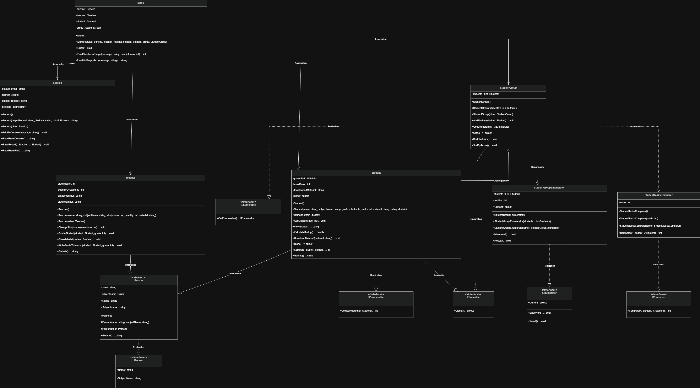

# Лабораторна робота №4

## 1. Титульна інформація

Київський національний університет імені Тараса Шевченка  
Факультет інформаційних технологій  
Кафедра програмних систем і технологій  
Дисципліна: Вступ до об'єктно-орієнтованого програмування  

Лабораторна робота №4  
Тема: Конструктори та Інтерфейси  
Виконав: Агапов Олександр, IPZ-11(1), 1 курс  
Рік: 2026

## 2. Мета роботи

Мета роботи (з методичних вказівок до ЛР4):

1. Навчитися повторному використанню коду через спадкування класів.
2. Навчитися створювати конструктори базових та похідних класів.
3. Побудувати ієрархію класів відповідно до варіанту завдання.
4. Навчитися розробляти оголошення та реалізацію інтерфейсів, а також використовувати стандартні інтерфейси .NET.
5. Навчитися працювати з абстрактними класами.

## 3. Умова задачі

Потрібно розробити консольну програму для моделювання спрощеного освітнього процесу, у якому беруть участь викладач, основний студент і група студентів. Програма має продемонструвати розвиток коду від першої до четвертої версії лабораторної роботи №4.

Функціональні вимоги до фінальної версії `LAB_4_V4`:

- змоделювати узагальнену сутність `Person`, яка містить спільні атрибути людини в освітньому процесі;
- реалізувати `Person` як звичайний базовий клас, який реалізує `IPerson`;
- заборонити створення об'єкта `Person` напряму за допомогою `protected` конструкторів;
- створити похідні класи `Teacher` і `Student`;
- реалізувати власний інтерфейс `IPerson` для спільних властивостей людини;
- продемонструвати поліморфне присвоєння об'єкта викладача змінній типу `IPerson`;
- змоделювати викладача, який має ім'я, дисципліну, навчальне навантаження, кількість студентів, журнал оцінок і навчальний матеріал;
- змоделювати студента, який має ім'я, дисципліну, список оцінок, кількість виконаних робіт, отриманий матеріал і рейтинг;
- дозволити викладачу змінювати навчальне навантаження;
- дозволити викладачу передавати навчальний матеріал студенту;
- дозволити викладачу ставити оцінку студенту;
- автоматично оновлювати список оцінок, кількість виконаних робіт і рейтинг студента;
- створити групу студентів як окрему сутність `StudentGroup`;
- додавати студентів до групи;
- сортувати групу за рейтингом через `IComparable<Student>`;
- сортувати групу за кількістю виконаних робіт через `IComparer<Student>`;
- перебирати групу студентів через `foreach`, реалізувавши `IEnumerable` та `IEnumerator`;
- показувати роботу програми через окремий клас `Menu`;
- виводити дані на консоль через клас `Service`;
- зберігати у `student_report.txt` як фінальний стан об'єктів, так і повний протокол консольної взаємодії.

У межах лабораторної роботи №4 не використовуються сутності, що належать лише до лабораторної роботи №3. Зокрема, у звіті та архітектурі ЛР4 не розглядаються дипломний проєкт і наукова стаття.

### Вимоги за версіями

- `V1` - спадкування, `Person` як базовий клас, `protected` конструктори, `Student`/`Teacher` через `base(...)`, `Service` для I/O.
- `V2` - `abstract Person` і демонстрація, що `new Person()` неможливий.
- `V3` - `IPerson`, `Person : IPerson`, поліморфізм через `IPerson.DisplayInfo()`.
- `V4` - `StudentGroup`, `IComparable`, `IComparer`, `IEnumerable`/`IEnumerator`, `foreach`, `ICloneable` і deep copy.

## 4. Аналіз задачі / OOA

Предметна область лабораторної роботи описує невелику частину освітнього процесу. Основними учасниками є викладач і студент, а додатковою структурою є група студентів, яка потрібна для демонстрації стандартних інтерфейсів порівняння, сортування та перебору.

На етапі об'єктно-орієнтованого аналізу було виділено такі сутності:

- `IPerson` - контракт для сутностей, які мають ім'я та назву дисципліни;
- `Person` - узагальнена людина в освітньому процесі;
- `Teacher` - викладач, який координує навчання, передає матеріал і ставить оцінки;
- `Student` - студент, який отримує матеріал, виконує роботи, має оцінки та рейтинг;
- `StudentGroup` - група студентів для сортування й перебору;
- `StudentGroupEnumerator` - об'єкт, який забезпечує ручний перебір студентів у групі;
- `StudentTasksComparer` - об'єкт для порівняння студентів за кількістю виконаних робіт;
- `Service` - технічна сутність для введення, виведення та збереження даних;
- `Menu` - технічна сутність для керування сценарієм роботи користувача;
- `Program` - точка входу, яка створює початкові об'єкти і запускає програму.

### IPerson

`IPerson` не є окремим учасником предметної області. Це інтерфейс, який фіксує спільний контракт для об'єктів, що мають властивості `Name`, `SubjectName` і поведінковий метод `DisplayInfo()`. Він потрібний для демонстрації поліморфізму: об'єкт конкретного класу можна розглядати через узагальнений інтерфейсний тип і викликати метод через інтерфейс.

### Person

`Person` представляє спільну частину викладача і студента. У версії 2 цей клас використано як абстрактний для демонстрації абстракції. У версіях 1, 3 і 4 `Person` є звичайним базовим класом із `protected` конструкторами, тому напряму об'єкт `Person` все одно не створюється. Клас містить ім'я та дисципліну, а також базовий метод `DisplayInfo()`.

### Teacher

`Teacher` описує викладача. Викладач має навчальне навантаження, кількість студентів, журнал оцінок і навчальний матеріал. Його поведінка включає:

- збільшення кількості студентів;
- зменшення кількості студентів;
- зміну кількості годин навчального навантаження;
- передавання матеріалу студенту;
- виставлення оцінки студенту;
- запис оцінки до журналу.

### Student

`Student` описує студента. Студент має список оцінок, кількість виконаних робіт, отриманий навчальний матеріал і рейтинг. Його поведінка включає:

- додавання оцінки;
- перегляд оцінок;
- розрахунок рейтингу;
- отримання навчального матеріалу;
- порівняння з іншим студентом за рейтингом.

### StudentGroup

`StudentGroup` моделює групу студентів. Цей клас не є просто технічним контейнером, оскільки у фінальній версії лабораторної роботи він демонструє важливі ООП-механізми:

- агрегацію об'єктів `Student`;
- сортування за природним порядком студентів через `IComparable<Student>`;
- сортування за альтернативним критерієм через `IComparer<Student>`;
- перебір через `IEnumerable`.

Група зберігає посилання на об'єкти студентів. Це важливо для коректності: якщо основному студенту додати оцінку через меню, група бачить той самий об'єкт, а не застарілу копію.

### StudentTasksComparer

`StudentTasksComparer` реалізує альтернативний спосіб порівняння студентів. Якщо `Student.CompareTo()` порівнює студентів за рейтингом, то `StudentTasksComparer.Compare()` порівнює їх за кількістю виконаних робіт. При однаковій кількості робіт використовується додаткове порівняння за рейтингом, щоб порядок був стабільним і змістовним.

### Service

`Service` є технічною сутністю. Його відповідальність - не бізнес-логіка освітнього процесу, а обслуговування введення, виведення та збереження. Клас:

- виводить повідомлення на консоль;
- читає рядок з консолі;
- накопичує протокол роботи програми;
- формує текстовий звіт;
- записує звіт у `student_report.txt`;
- читає дані з файлу.

### Menu

`Menu` відповідає за сценарій взаємодії користувача з програмою. Воно не зберігає предметні дані як власні бізнес-об'єкти, а отримує готові об'єкти `Service`, `Teacher`, `Student` і `StudentGroup` через конструктор. Через меню користувач запускає дії викладача, студента і групи.

### Основні сценарії роботи

У фінальній версії програми реалізовано такі сценарії:

- запуск програми і створення початкових об'єктів;
- демонстрація поліморфізму через `IPerson`;
- передавання навчального матеріалу від викладача до студента;
- виставлення оцінки студенту;
- зміна навчального навантаження викладача;
- збільшення або зменшення кількості студентів;
- перегляд інформації про викладача та студента;
- перебір групи студентів через `foreach`;
- сортування групи за рейтингом;
- сортування групи за кількістю виконаних робіт;
- збереження результатів і протоколу роботи у файл.

## 5. Об'єктно-орієнтоване проєктування / OOD

На етапі об'єктно-орієнтованого проєктування сутності предметної області були перенесені у класи C# з урахуванням принципів інкапсуляції, успадкування, абстракції та поліморфізму.

### Відповідність сутностей і класів

- людина - `Person`;
- контракт людини - `IPerson`;
- викладач - `Teacher`;
- студент - `Student`;
- група студентів - `StudentGroup`;
- перебирач студентів - `StudentGroupEnumerator`;
- порівнювач студентів за роботами - `StudentTasksComparer`;
- сервіс введення/виведення - `Service`;
- консольне меню - `Menu`;
- запуск програми - `Program`.

### Рішення щодо класу Person

У лабораторній роботі №4 статус класу `Person` залежить від версії: у `V2` він абстрактний для демонстрації абстракції, а у `V1`, `V3` і `V4` — звичайний базовий клас. В усіх версіях реальними об'єктами предметної області є `Teacher` і `Student`.

Конструктори `Person` мають модифікатор `protected`. Це означає, що їх можуть викликати лише похідні класи. Такий підхід відповідає предметній області: створювати потрібно `Teacher` або `Student`, а не базовий `Person`.

### Успадкування Teacher і Student

`Teacher` і `Student` успадковують `Person`, тому отримують спільні властивості `Name` і `SubjectName`. У похідних класах ці властивості використовуються через зручніші предметні назви:

- `TeacherName` у класі `Teacher`;
- `StudentName` у класі `Student`;
- `SubjectName` як успадкована назва дисципліни.

Конструктори похідних класів викликають конструктори базового класу через `base(...)`, що забезпечує правильну ініціалізацію успадкованої частини об'єкта.

### Агрегація StudentGroup

`StudentGroup` містить список студентів. Це агрегація, тому що група працює з об'єктами студентів, але студент може існувати окремо від конкретної групи. У фінальній версії група зберігає посилання на студентів, а не створює копії при додаванні. Це дозволяє сортувати та переглядати актуальні об'єкти.

Наприклад, основний студент створюється в `Program`, додається до `StudentGroup`, а пізніше через меню отримує нову оцінку. Оскільки група має посилання на цей самий об'єкт, сортування після зміни оцінки працює з актуальним рейтингом і кількістю виконаних робіт.

### Взаємодія Menu з об'єктами

`Menu` отримує об'єкти `Service`, `Teacher`, `Student` і `StudentGroup` через конструктор. Це робить сценарій роботи явним: меню не створює приховану альтернативну модель, а працює з тими самими об'єктами, які були створені в `Program`.

Основний цикл `Menu.Run()`:

1. показує список команд;
2. читає вибір користувача через `Service`;
3. викликає відповідний приватний метод меню;
4. приватний метод звертається до предметних класів;
5. результат виводиться через `Service`;
6. усі повідомлення накопичуються у протоколі.

### Роль Service у проєктуванні

`Service` відокремлює технічні операції від предметних класів. `Teacher` і `Student` не повинні самостійно формувати файл звіту. Вони відповідають за власний стан і поведінку, а `Service` відповідає за збереження результатів.

Метод `SaveReport(Teacher teacher, Student student)` формує структурований звіт, де містяться:

- дані викладача;
- дисципліна;
- навчальне навантаження;
- кількість студентів;
- навчальний матеріал;
- журнал оцінок;
- дані студента;
- список оцінок;
- кількість виконаних робіт;
- рейтинг;
- отриманий матеріал;
- протокол усіх повідомлень і введень користувача.

## 6. Графічне зображення структури програми

### 6.1. UML class diagram

UML class diagram для лабораторної роботи №4 відображає фінальну структуру класів версії `LAB_4_V4`.

На діаграмі мають бути показані такі елементи:

- інтерфейс `IPerson`;
- базовий клас `Person`;
- похідні класи `Teacher` і `Student`;
- клас `Student`, який реалізує `IComparable<Student>`;
- клас `StudentTasksComparer`, який реалізує `IComparer<Student>`;
- клас `StudentGroup`, який реалізує `IEnumerable`;
- клас `StudentGroupEnumerator`, який реалізує `IEnumerator`;
- клас `Service`;
- клас `Menu`;
- клас `Program`.

Основні зв'язки на діаграмі:

- `Person ..|> IPerson` - реалізація інтерфейсу `IPerson`;
- `Teacher --|> Person` - успадкування від базового класу;
- `Student --|> Person` - успадкування від базового класу;
- `Student ..|> IComparable<Student>` - реалізація порівняння за рейтингом;
- `StudentTasksComparer ..|> IComparer<Student>` - реалізація альтернативного порівняння;
- `StudentGroup ..|> IEnumerable` - підтримка перебору через `foreach`;
- `StudentGroupEnumerator ..|> IEnumerator` - ручний перебір елементів групи;
- `StudentGroup o-- Student` - агрегація студентів у групі;
- `Menu --> Service` - використання сервісу для введення, виведення та збереження;
- `Menu --> Teacher` - використання дій викладача;
- `Menu --> Student` - використання поточного студента;
- `Menu --> StudentGroup` - сортування і перебір групи;
- `Program ..> Menu` - створення та запуск меню.

Діаграма класів надається окремо у файлі `images/Lab4_ClassDiagram.png`.



### 6.2. UML Use Case diagram

UML Use Case diagram описує сценарії використання програми з погляду користувача, який працює з консольним меню.

Головний актор - `User`. Він запускає програму, обирає команди меню і отримує результати на консолі. Логічно сценарії можна згрупувати так:

1. Information:
   - переглянути інформацію про викладача та студента;
   - переглянути список оцінок;
   - переглянути рейтинг студента.

2. Interaction:
   - змінити навчальне навантаження викладача;
   - передати навчальний матеріал студенту;
   - поставити оцінку студенту;
   - оновити журнал оцінок.

3. Group Management:
   - збільшити кількість студентів;
   - зменшити кількість студентів;
   - відсортувати групу за рейтингом;
   - відсортувати групу за кількістю виконаних робіт.

4. Iteration and Report:
   - перебрати студентів через `foreach`;
   - зберегти результати у файл;
   - завершити роботу програми.

Use Case діаграма надається окремо у файлі `images/Lab4_UseCaseDiagram.png`.

## 7. Структура програми

Фінальна версія `LAB_4_V4` містить такі файли C#:

- `Program.cs` - точка входу в програму. Створює початкові об'єкти `Service`, `Teacher`, `Student`, `StudentGroup`, демонструє `IPerson` і запускає меню.
- `IPerson.cs` - містить інтерфейс `IPerson` зі спільними властивостями `Name` і `SubjectName`.
- `Person.cs` - містить базовий клас `Person`, його закриті поля, захищені конструктори, властивості та метод `DisplayInfo()/GetInfo()`.
- `Teacher.cs` - містить клас `Teacher`, який успадковує `Person` і реалізує поведінку викладача.
- `Student.cs` - містить клас `Student`, який успадковує `Person` і реалізує `IComparable<Student>`.
- `StudentGroup.cs` - містить клас `StudentGroup`, який агрегує студентів і реалізує `IEnumerable`.
- `StudentGroupEnumerator.cs` - містить клас `StudentGroupEnumerator`, який реалізує `IEnumerator` для ручного перебору студентів.
- `StudentTasksComparer.cs` - містить клас `StudentTasksComparer`, який реалізує `IComparer<Student>` для сортування за кількістю виконаних робіт.
- `Service.cs` - містить клас `Service`, який відповідає за консоль, протокол і файл `student_report.txt`.
- `Menu.cs` - містить клас `Menu`, який реалізує головний цикл взаємодії користувача з програмою.

Додатковий файл результатів:

- `student_report.txt` - файл, у який зберігається фінальний стан освітнього процесу і протокол консольної взаємодії.

## 8. Опис основних класів

### IPerson

`IPerson` - інтерфейс для узагальнення спільних властивостей і базової поведінки людини.

Основні члени:

- `Name` - ім'я людини;
- `SubjectName` - назва дисципліни;
- `DisplayInfo()` - поведінковий метод для демонстрації поліморфного виклику.

У версії 3 інтерфейс `IPerson` містить не лише властивості `Name` і `SubjectName`, а й поведінковий метод `DisplayInfo()`. У `Program.cs` створюються змінні типу `IPerson`, яким присвоюються об'єкти `Student` і `Teacher`. Виклик `DisplayInfo()` через `IPerson` демонструє поліморфізм: тип посилання однаковий, але виконується реалізація конкретного класу.

### Person

`Person` - базовий клас для учасників освітнього процесу (абстрактний у V2, звичайний у V1/V3/V4).

Основні поля:

- `name` - ім'я людини;
- `subjectName` - назва дисципліни.

Основні властивості:

- `Name`;
- `SubjectName`.

Основні методи:

- `DisplayInfo()` - виводить ім'я та дисципліну.

Конструктори:

- `protected Person()` - задає порожні значення;
- `protected Person(string name, string subjectName)` - задає ім'я та дисципліну;
- `protected Person(Person other)` - копіює спільні поля з іншого об'єкта.

### Teacher

`Teacher` - клас викладача, похідний від `Person`.

Основні поля:

- `studyHours` - кількість навчальних годин;
- `quantityOfStudents` - кількість студентів;
- `gradesJournal` - журнал оцінок;
- `studyMaterial` - навчальний матеріал.

Основні властивості:

- `TeacherName`;
- `SubjectName`;
- `StudyHours`;
- `QuantityOfStudents`;
- `GradesJournal`;
- `StudyMaterial`.

Основні методи:

- `IncreaseStudents(int count)` - збільшує кількість студентів;
- `DecreaseStudents(int count)` - зменшує кількість студентів;
- `ChangeStudyHours(int newHours)` - змінює навчальне навантаження;
- `GiveMaterial(Student student)` - передає матеріал студенту;
- `GradeStudent(Student student, int grade)` - ставить оцінку студенту і записує її в журнал.

### Student

`Student` - клас студента, похідний від `Person`, який реалізує `IComparable<Student>`.

Основні поля:

- `gradesList` - список оцінок;
- `tasksDone` - кількість виконаних робіт;
- `downloadedMaterial` - отриманий матеріал;
- `rating` - середній рейтинг.

Основні властивості:

- `StudentName`;
- `GradesList`;
- `TasksDone`;
- `DownloadedMaterial`;
- `Rating`.

Основні методи:

- `AddGrade(int grade)` - додає оцінку і збільшує кількість виконаних робіт;
- `ViewGrades()` - повертає оцінки у вигляді текстового рядка;
- `CalculateRating()` - розраховує середнє арифметичне оцінок;
- `DownloadMaterial(string material)` - зберігає отриманий матеріал;
- `CompareTo(Student other)` - порівнює студентів за рейтингом у порядку спадання.

### StudentGroup

`StudentGroup` - клас групи студентів.

Основне поле:

- `students` - список студентів.

Основні методи:

- `AddStudent(Student student)` - додає студента до групи;
- `GetEnumerator()` - повертає перебирач для `foreach`;
- `SortStudents()` - сортує студентів за рейтингом через `IComparable<Student>`;
- `SortByTasks()` - сортує студентів за кількістю виконаних робіт через `StudentTasksComparer`.

### StudentGroupEnumerator

`StudentGroupEnumerator` - клас ручного перебору студентів.

Основні поля:

- `students` - список студентів для перебору;
- `position` - поточна позиція.

Основні члени:

- `MoveNext()` - переходить до наступного студента;
- `Reset()` - повертає позицію перед першим елементом;
- `Current` - повертає поточного студента.

### StudentTasksComparer

`StudentTasksComparer` - клас альтернативного порівняння студентів.

Основний метод:

- `Compare(Student x, Student y)` - порівнює студентів за кількістю виконаних робіт у порядку спадання. Якщо кількість робіт однакова, використовується порівняння за рейтингом у порядку спадання.

### Service

`Service` - технічний клас для роботи з консоллю і файлами.

Основні поля:

- `outputFormat` - формат виведення;
- `filePath` - шлях до файлу;
- `dataToProcess` - дані для збереження;
- `protocol` - список рядків протоколу роботи програми.

Основні методи:

- `PrintToConsole(string msg)` - виводить повідомлення на консоль і додає його до протоколу;
- `ReadFromConsole()` - читає рядок з консолі і додає введення до протоколу;
- `SaveReport(Teacher teacher, Student student)` - формує звіт і записує його у файл;
- `ReadFromFile()` - читає текст з файлу.

### Menu

`Menu` - клас керування сценарієм роботи програми.

Основні поля:

- `service`;
- `teacher`;
- `student`;
- `group`.

Основні методи:

- `Run()` - запускає головний цикл меню;
- `ShowInformation()` - показує дані викладача і студента;
- `ChangeTeacherHours()` - змінює навчальне навантаження;
- `GiveMaterialToStudent()` - передає матеріал студенту;
- `GradeStudent()` - ставить оцінку студенту;
- `SaveData()` - зберігає дані у файл;
- `IncreaseStudents()` - збільшує кількість студентів;
- `DecreaseStudents()` - зменшує кількість студентів;
- `ShowStudentsByForeach()` - перебирає групу через `foreach`;
- `SortStudentsByRating()` - сортує групу за рейтингом;
- `SortStudentsByTasks()` - сортує групу за кількістю робіт.

## 9. Реалізація основних ООП-механізмів

### Конструктори

У роботі використовуються три основні типи конструкторів.

Конструктор за замовчуванням створює об'єкт із порожніми або нульовими значеннями. Наприклад, `Student()` створює студента з порожнім списком оцінок, нульовою кількістю робіт і нульовим рейтингом.

Конструктор з параметрами дозволяє створити об'єкт з готовими значеннями. Наприклад, у `Student(string studentName, string subjectName, List<int> gradesList, int tasksDone, string downloadedMaterial, double rating)` одразу задаються ім'я, дисципліна, оцінки, кількість робіт, матеріал і рейтинг.

Конструктор копіювання створює новий об'єкт на основі іншого. У класі `Student` список оцінок копіюється в новий список, тобто новий студент не отримує пряме посилання на той самий список оцінок. У класі `Service` копіюється також список рядків протоколу.

У доменних і технічних класах фінальної версії реалізовано такі конструктори:

- `Person` - три захищені конструктори;
- `Teacher` - конструктор за замовчуванням, з параметрами, копіювання;
- `Student` - конструктор за замовчуванням, з параметрами, копіювання;
- `Service` - конструктор за замовчуванням, з параметрами, копіювання;
- `Menu` - конструктор за замовчуванням, з параметрами, копіювання;
- `StudentGroup` - конструктор за замовчуванням, з параметрами, копіювання;
- `StudentGroupEnumerator` - конструктор за замовчуванням, з параметрами, копіювання;
- `StudentTasksComparer` - конструктор за замовчуванням, з параметрами, копіювання.

### Абстракція та Поліморфізм

Абстракція окремо демонструється у версії 2 через `abstract class Person`. У версії 4 клас `Person` є звичайним базовим класом, який реалізує `IPerson`. Таким чином, абстрактність перевіряється у V2, а у V4 основний акцент зроблено на стандартних інтерфейсах .NET.

Конструктори `Person` мають модифікатор `protected`. Це означає, що вони доступні для `Teacher` і `Student`, але недоступні для прямого створення об'єкта `Person` у зовнішньому коді.

Поліморфізм продемонстровано через інтерфейс `IPerson`. У програмі створюються об'єкти `Student` і `Teacher`, які використовуються через посилання типу `IPerson`:

```csharp
IPerson firstPerson = new Student("Студент для інтерфейсу", "ООП", new List<int>(), 0, "", 0);
IPerson secondPerson = new Teacher("Викладач для інтерфейсу", "ООП", 100, 1, "", "Матеріал для інтерфейсу");
firstPerson.DisplayInfo();
secondPerson.DisplayInfo();
```

Це показує, що конкретні об'єкти можна розглядати через узагальнений контракт, а виклик `DisplayInfo()` виконує реалізацію відповідного класу.

### Робота з інтерфейсами .NET

`IComparable<Student>` реалізовано в класі `Student`. Метод `CompareTo(Student other)` порівнює поточного студента з іншим студентом за рейтингом. Порядок сортування - спадний, тобто студент з більшим рейтингом повинен бути раніше.

`IComparer<Student>` реалізовано в класі `StudentTasksComparer`. Метод `Compare(Student x, Student y)` порівнює двох студентів за кількістю виконаних робіт. Якщо кількість робіт однакова, застосовується додаткове порівняння за рейтингом.

`IEnumerable` реалізовано в класі `StudentGroup`. Метод `GetEnumerator()` повертає об'єкт `StudentGroupEnumerator`.

`IEnumerator` реалізовано в класі `StudentGroupEnumerator`. Він містить методи `MoveNext()`, `Reset()` і властивість `Current`, які забезпечують ручний перебір студентів.

### ICloneable і Deep Copy

У версії 4 реалізовано `ICloneable` для класів `Student` і `StudentGroup`. Метод `Student.Clone()` створює нового студента через копіювальний конструктор. Список оцінок копіюється через створення нового `List<int>`, тому копія студента не має спільного списку оцінок з оригіналом. У властивості `GradesList` використовується defensive copy: getter повертає копію списку, а setter також створює новий список на основі переданого значення.

Метод `StudentGroup.Clone()` створює нову групу студентів і додає до неї клони студентів, а не ті самі посилання. Тому копія групи є незалежною від оригінальної групи. Це демонструє різницю між shallow copy, коли копіюються лише посилання, і deep copy, коли створюються нові об'єкти в пам'яті.

### Збереження стану та протоколу

Клас `Service` містить поле:

```csharp
private List<string> protocol;
```

Метод `PrintToConsole(string msg)` не лише виводить повідомлення через `Console.WriteLine`, а й додає це повідомлення до `protocol`.

Метод `ReadFromConsole()` читає введення користувача і записує його до протоколу з префіксом `> `. Завдяки цьому у фінальному звіті видно не тільки повідомлення програми, а й відповіді користувача.

Метод `SaveReport(Teacher teacher, Student student)` формує дві частини звіту:

- стан об'єктів освітнього процесу;
- повний протокол роботи програми.

Результат записується у файл `student_report.txt`.

## 10. Результати виконання програми (Консольний вивід)

Нижче наведено реалістичний приклад роботи фінальної версії `LAB_4_V4`. Порядок сортування за рейтингом є строго спадним: `97 -> 95 -> 91 -> 77.5`. Порядок сортування за кількістю виконаних робіт також спадний: `4 -> 3 -> 2 -> 2`.

```text
Програму запущено.
Демонстрація IPerson: Ковалюк Т.В.
Викладач передав матеріал і поставив оцінку основному студенту.
Групу відсортовано за рейтингом через IComparable<Student>.
Групу відсортовано за кількістю робіт через IComparer<Student>.

--- Меню освітнього процесу ---
1. Показати інформацію про викладача та студента
2. Викладач: змінити кількість годин навантаження
3. Викладач: передати навчальний матеріал студенту
4. Викладач: поставити оцінку студенту
5. Зберегти результати у файл
6. Викладач: збільшити кількість студентів
7. Викладач: зменшити кількість студентів
8. Перебрати студентів через foreach
9. Відсортувати студентів за рейтингом
10. Відсортувати студентів за кількістю виконаних робіт
0. Вийти
Оберіть пункт:
4
Введіть оцінку студента (0-100):
95
Оцінку виставлено і записано в журнал

--- Меню освітнього процесу ---
1. Показати інформацію про викладача та студента
2. Викладач: змінити кількість годин навантаження
3. Викладач: передати навчальний матеріал студенту
4. Викладач: поставити оцінку студенту
5. Зберегти результати у файл
6. Викладач: збільшити кількість студентів
7. Викладач: зменшити кількість студентів
8. Перебрати студентів через foreach
9. Відсортувати студентів за рейтингом
10. Відсортувати студентів за кількістю виконаних робіт
0. Вийти
Оберіть пункт:
9

Студентів відсортовано за рейтингом.

--- Студенти групи ---
Студент: Сидоренко Олена
Дисципліна: ООП
Рейтинг: 97
Виконано робіт: 4

Студент: Агапов Олександр
Дисципліна: ООП
Рейтинг: 95
Виконано робіт: 2

Студент: Іваненко Марія
Дисципліна: ООП
Рейтинг: 91
Виконано робіт: 3

Студент: Петренко Назар
Дисципліна: ООП
Рейтинг: 77.5
Виконано робіт: 2

--- Меню освітнього процесу ---
1. Показати інформацію про викладача та студента
2. Викладач: змінити кількість годин навантаження
3. Викладач: передати навчальний матеріал студенту
4. Викладач: поставити оцінку студенту
5. Зберегти результати у файл
6. Викладач: збільшити кількість студентів
7. Викладач: зменшити кількість студентів
8. Перебрати студентів через foreach
9. Відсортувати студентів за рейтингом
10. Відсортувати студентів за кількістю виконаних робіт
0. Вийти
Оберіть пункт:
10

Студентів відсортовано за кількістю виконаних робіт.

--- Студенти групи ---
Студент: Сидоренко Олена
Дисципліна: ООП
Рейтинг: 97
Виконано робіт: 4

Студент: Іваненко Марія
Дисципліна: ООП
Рейтинг: 91
Виконано робіт: 3

Студент: Агапов Олександр
Дисципліна: ООП
Рейтинг: 95
Виконано робіт: 2

Студент: Петренко Назар
Дисципліна: ООП
Рейтинг: 77.5
Виконано робіт: 2

--- Меню освітнього процесу ---
1. Показати інформацію про викладача та студента
2. Викладач: змінити кількість годин навантаження
3. Викладач: передати навчальний матеріал студенту
4. Викладач: поставити оцінку студенту
5. Зберегти результати у файл
6. Викладач: збільшити кількість студентів
7. Викладач: зменшити кількість студентів
8. Перебрати студентів через foreach
9. Відсортувати студентів за рейтингом
10. Відсортувати студентів за кількістю виконаних робіт
0. Вийти
Оберіть пункт:
5
Дані успішно оброблені сервісом та збережені у файл student_report.txt

--- Меню освітнього процесу ---
1. Показати інформацію про викладача та студента
2. Викладач: змінити кількість годин навантаження
3. Викладач: передати навчальний матеріал студенту
4. Викладач: поставити оцінку студенту
5. Зберегти результати у файл
6. Викладач: збільшити кількість студентів
7. Викладач: зменшити кількість студентів
8. Перебрати студентів через foreach
9. Відсортувати студентів за рейтингом
10. Відсортувати студентів за кількістю виконаних робіт
0. Вийти
Оберіть пункт:
0
Програму завершено
Фінальний звіт буде збережено у файл student_report.txt.
```

## 11. Аналіз достовірності результатів / контрольний приклад

### 11.1. Перевірка сортування за рейтингом (IComparable)

У фінальній версії рейтинг студента обчислюється як середнє арифметичне всіх оцінок.

Контрольні дані для групи:

- Сидоренко Олена: оцінки `100, 96, 98, 94`; рейтинг `(100 + 96 + 98 + 94) / 4 = 388 / 4 = 97`;
- Агапов Олександр: оцінки `95, 95`; рейтинг `(95 + 95) / 2 = 190 / 2 = 95`;
- Іваненко Марія: оцінки `90, 95, 88`; рейтинг `(90 + 95 + 88) / 3 = 273 / 3 = 91`;
- Петренко Назар: оцінки `75, 80`; рейтинг `(75 + 80) / 2 = 155 / 2 = 77.5`.

Очікуваний порядок за спаданням рейтингу:

```text
97 -> 95 -> 91 -> 77.5
```

Метод `CompareTo(Student other)` у класі `Student` повертає результат порівняння рейтингу іншого студента з рейтингом поточного студента:

```csharp
return other.CalculateRating().CompareTo(CalculateRating());
```

Якщо порівнюються Агапов Олександр і Сидоренко Олена:

- поточний студент: Агапов, рейтинг `95`;
- інший студент: Сидоренко, рейтинг `97`;
- виклик: `97.CompareTo(95)`;
- результат додатний;
- під час сортування студент з рейтингом `97` розміщується раніше за студента з рейтингом `95`.

Якщо порівнюються Іваненко Марія і Агапов Олександр:

- поточний студент: Іваненко, рейтинг `91`;
- інший студент: Агапов, рейтинг `95`;
- виклик: `95.CompareTo(91)`;
- результат додатний;
- студент з рейтингом `95` розміщується раніше за студента з рейтингом `91`.

Отже, алгоритм забезпечує правильне спадне сортування за рейтингом.

### 11.2. Перевірка сортування за завданнями (IComparer)

Для сортування за кількістю виконаних робіт використовується клас `StudentTasksComparer`.

Контрольні дані:

- Сидоренко Олена: `4` виконані роботи;
- Іваненко Марія: `3` виконані роботи;
- Агапов Олександр: `2` виконані роботи;
- Петренко Назар: `2` виконані роботи.

Очікуваний порядок за кількістю робіт:

```text
4 -> 3 -> 2 -> 2
```

Основна частина методу `Compare(Student x, Student y)`:

```csharp
if (x.TasksDone != y.TasksDone)
{
    return y.TasksDone.CompareTo(x.TasksDone);
}

return y.CalculateRating().CompareTo(x.CalculateRating());
```

Якщо порівнюються Іваненко Марія і Сидоренко Олена:

- `x.TasksDone = 3`;
- `y.TasksDone = 4`;
- виклик: `4.CompareTo(3)`;
- результат додатний;
- студент з `4` роботами повинен стояти раніше.

Якщо порівнюються Агапов Олександр і Петренко Назар:

- `x.TasksDone = 2`;
- `y.TasksDone = 2`;
- кількість робіт однакова;
- застосовується додаткове порівняння за рейтингом;
- рейтинг Агапова: `95`;
- рейтинг Петренка: `77.5`;
- студент з рейтингом `95` стоїть раніше.

Отже, сортування за роботами працює коректно: спочатку враховується кількість виконаних робіт, а при рівності - рейтинг.

## 12. Висновок

У лабораторній роботі №4 було реалізовано консольну модель освітнього процесу з використанням основних принципів об'єктно-орієнтованого програмування.

Під час виконання роботи було закріплено поняття успадкування: класи `Teacher` і `Student` успадковують спільні властивості від базового класу `Person`. Було показано, що базовий клас може містити спільну частину стану та поведінки, а похідні класи можуть доповнювати її власними полями і методами.

Абстракцію реалізовано у версії 2 через `abstract class Person`, що демонструє неможливість `new Person()`. У версії 4 клас `Person` є звичайним базовим класом, який реалізує `IPerson`, а роль обмеження створення базового об'єкта забезпечується `protected` конструкторами.

Поліморфізм у версії 3 продемонстровано через `IPerson`, який містить не лише властивості, а й метод `DisplayInfo()`. Через змінні типу `IPerson` викликається `DisplayInfo()` для `Student` і `Teacher`, що демонструє виконання реалізації конкретного класу.

Окрему увагу приділено стандартним інтерфейсам .NET. `IComparable<Student>` використано для природного сортування студентів за рейтингом. `IComparer<Student>` використано для альтернативного сортування за кількістю виконаних робіт. `IEnumerable` та `IEnumerator` (через окремий клас `StudentGroupEnumerator`) дали змогу перебирати групу студентів через `foreach`. Також у версії 4 реалізовано `ICloneable` і deep copy для `Student` та `StudentGroup`.

Також було реалізовано службовий клас `Service`, який відповідає за консольне введення, виведення, накопичення протоколу та збереження результатів. Це відповідає принципу єдиної відповідальності: предметні класи описують освітній процес, а технічний клас відповідає за взаємодію з консоллю та файлами.

У результаті було отримано програму, яка демонструє конструктори, інкапсуляцію, успадкування, абстракцію, поліморфізм, стандартні інтерфейси C# і файлове збереження протоколу роботи.

Недоопрацьованими можливостями є відсутність графічного інтерфейсу (GUI) та роботи з реляційними базами даних. У подальшому програму можна вдосконалити, замінивши використання локальних текстових файлів на повноцінну базу даних (наприклад, SQLite або PostgreSQL) та реалізувавши візуальний інтерфейс користувача (WPF або Windows Forms).
